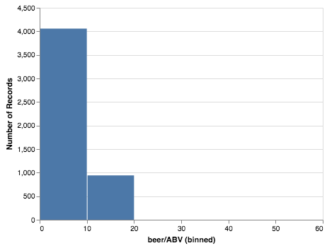
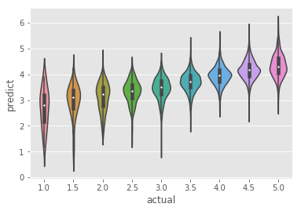

Craft Beer Ratings
==================

.. code:: ipython3

    %autosave 0

.. parsed-literal::

    Autosave disabled

.. code:: ipython3

    %matplotlib inline
    import string
    from  collections import Counter
    import pandas as pd
    import numpy as np
    import matplotlib
    import matplotlib.pyplot as plt
    import psycopg2
    import seaborn as sbn
    from altair import Chart, X, Y, Color, Scale
    import altair as alt
    import requests
    import nltk
    from nltk.corpus import stopwords
    from sklearn.model_selection import train_test_split
    from sklearn.linear_model import LinearRegression, LogisticRegression
    from sklearn.metrics import accuracy_score
    from sklearn.preprocessing import StandardScaler, MinMaxScaler
    from graphviz import Digraph

    matplotlib.style.use('ggplot')

Reading List
------------

-  Reshaping data
-  `Linear
   Regression <https://medium.com/@amarbudhiraja/ml-101-linear-regression-tutorial-1e40e29f1934>`__
-  Mulitple Regression
-  Logistic Regression
-  Sentiment Analysis and NLTK
-  `Think like a Statistician – Without the
   Math <https://flowingdata.com/2010/03/04/think-like-a-statistician-without-the-math/>`__

Exploratory Questions
---------------------

1.  Is the data complete? What data is missing and how much?
2.  what is the highest/lowest rated beer? (based on the average of all
    of its ratings)
3.  What is the distribution of the overall beer ratings?
4.  Are there styles of beers that tend to get higher ratings than
    others?
5.  Does the ABV values for beer correlate with any of the reviews /
    rankings?
6.  What is the breakdown of gender for the reviewers?
7.  Do any of the styles of beers appeal more to one gender or the
    other?
8.  Show all the beers from the brewer with the highest average rating
9.  Is the taste rating a good predictor for the overall rating?
10. If we simplify the problem to a thumbs-up versus thumbs-down rating
    can we predict better?

Research Question (Kaggle contest)
----------------------------------

1. Can we use the textual review of to predict an overall rating for the
   beer?

This is a great research question for us because there is a lot of
freedom to process the text reviews in any way we want/can in order to
make the best ratings possible.

.. code:: ipython3

    bf = pd.read_csv('Data/beer_train.csv')

.. code:: ipython3

    bf.head()

.. raw:: html

    

    
    <table border="1" class="dataframe">
      <thead>
        <tr style="text-align: right;">
          <th></th>
          <th>index</th>
          <th>beer/ABV</th>
          <th>beer/beerId</th>
          <th>beer/brewerId</th>
          <th>beer/name</th>
          <th>beer/style</th>
          <th>review/appearance</th>
          <th>review/aroma</th>
          <th>review/overall</th>
          <th>review/palate</th>
          <th>review/taste</th>
          <th>review/text</th>
          <th>review/timeStruct</th>
          <th>review/timeUnix</th>
          <th>user/ageInSeconds</th>
          <th>user/birthdayRaw</th>
          <th>user/birthdayUnix</th>
          <th>user/gender</th>
          <th>user/profileName</th>
        </tr>
      </thead>
      <tbody>
        <tr>
          <th>0</th>
          <td>40163</td>
          <td>5.0</td>
          <td>46634</td>
          <td>14338</td>
          <td>Chiostro</td>
          <td>Herbed / Spiced Beer</td>
          <td>4.0</td>
          <td>4.0</td>
          <td>4.0</td>
          <td>4.0</td>
          <td>4.0</td>
          <td>Pours a clouded gold with a thin white head. N...</td>
          <td>{'min': 38, 'hour': 3, 'mday': 16, 'sec': 10, ...</td>
          <td>1229398690</td>
          <td>NaN</td>
          <td>NaN</td>
          <td>NaN</td>
          <td>NaN</td>
          <td>RblWthACoz</td>
        </tr>
        <tr>
          <th>1</th>
          <td>8135</td>
          <td>11.0</td>
          <td>3003</td>
          <td>395</td>
          <td>Bearded Pat's Barleywine</td>
          <td>American Barleywine</td>
          <td>4.0</td>
          <td>3.5</td>
          <td>3.5</td>
          <td>3.5</td>
          <td>3.0</td>
          <td>12oz bottle into 8oz snifter.\t\tDeep ruby red...</td>
          <td>{'min': 38, 'hour': 23, 'mday': 8, 'sec': 58, ...</td>
          <td>1218238738</td>
          <td>NaN</td>
          <td>NaN</td>
          <td>NaN</td>
          <td>NaN</td>
          <td>BeerSox</td>
        </tr>
        <tr>
          <th>2</th>
          <td>10529</td>
          <td>4.7</td>
          <td>961</td>
          <td>365</td>
          <td>Naughty Nellie's Ale</td>
          <td>American Pale Ale (APA)</td>
          <td>3.5</td>
          <td>4.0</td>
          <td>3.5</td>
          <td>3.5</td>
          <td>3.5</td>
          <td>First enjoyed at the brewpub about 2 years ago...</td>
          <td>{'min': 7, 'hour': 18, 'mday': 26, 'sec': 2, '...</td>
          <td>1101492422</td>
          <td>NaN</td>
          <td>NaN</td>
          <td>NaN</td>
          <td>Male</td>
          <td>mschofield</td>
        </tr>
        <tr>
          <th>3</th>
          <td>44610</td>
          <td>4.4</td>
          <td>429</td>
          <td>1</td>
          <td>Pilsner Urquell</td>
          <td>Czech Pilsener</td>
          <td>3.0</td>
          <td>3.0</td>
          <td>2.5</td>
          <td>3.0</td>
          <td>3.0</td>
          <td>First thing I noticed after pouring from green...</td>
          <td>{'min': 7, 'hour': 1, 'mday': 20, 'sec': 5, 'y...</td>
          <td>1308532025</td>
          <td>1.209827e+09</td>
          <td>Aug 10, 1976</td>
          <td>208508400.0</td>
          <td>Male</td>
          <td>molegar76</td>
        </tr>
        <tr>
          <th>4</th>
          <td>37062</td>
          <td>4.4</td>
          <td>4904</td>
          <td>1417</td>
          <td>Black Sheep Ale (Special)</td>
          <td>English Pale Ale</td>
          <td>4.0</td>
          <td>3.0</td>
          <td>3.0</td>
          <td>3.5</td>
          <td>2.5</td>
          <td>A: pours an amber with a one finger head but o...</td>
          <td>{'min': 51, 'hour': 6, 'mday': 12, 'sec': 48, ...</td>
          <td>1299912708</td>
          <td>NaN</td>
          <td>NaN</td>
          <td>NaN</td>
          <td>NaN</td>
          <td>Brewbro000</td>
        </tr>
      </tbody>
    </table>
    

Checking for missing data
~~~~~~~~~~~~~~~~~~~~~~~~~

The easiest way to check for missing data in pandas is to use the
``isna`` method on the DataFrame. Used alone this gives you a giant
table of True/False values depending on whether a particular cell in the
dataframe has a value. We are interested in knowing if any of our
columns have missing values and we can use the any function to reduce
the big matrix into a table of columns.

.. code:: ipython3

    bf.isna().any(axis=0)

.. parsed-literal::

    index                False
    beer/ABV             False
    beer/beerId          False
    beer/brewerId        False
    beer/name            False
    beer/style           False
    review/appearance    False
    review/aroma         False
    review/overall       False
    review/palate        False
    review/taste         False
    review/text           True
    review/timeStruct    False
    review/timeUnix      False
    user/ageInSeconds     True
    user/birthdayRaw      True
    user/birthdayUnix     True
    user/gender           True
    user/profileName      True
    dtype: bool

The next question is how many values are missing? And, should we try to replace those values some way?

.. code:: ipython3

    print("total len = ", len(bf))
    print("missing: ", len(bf[bf['user/gender'].isna() == True]))

.. parsed-literal::

    total len =  37500
    missing:  22186

Distribution of ratings
-----------------------

To get a sense for the overall distribution of ratings of the beer.

.. code:: ipython3

    alt.Chart(bf[['review/overall']].sample(5000)).mark_bar().encode(alt.X('review/overall', bin=True), alt.Y('count()'))

.. image:: BeerPredictions_files/BeerPredictions_14_0.png

What are the Highest / Lowest rated beers according to their mean overall rating
--------------------------------------------------------------------------------

For this question we want to group the beer by their id (some beers from
different brewers **do** have the same name so we use the id to be sure
that we are getting the ratings only for a particular beer.

.. code:: ipython3

    dot = Digraph(comment='The Round Table')

    dot.node('A', 'Load Data')
    dot.node('B', 'Group Data')
    dot.node('L', 'Aggregate')
    dot.node('S', 'Sort on rating from high to low')
    dot.node('J', 'Join back to original')
    dot.node('F', 'filter out extra columns')
    dot.edges(['AB', 'BL', 'LS', 'SJ', 'JF'])

    dot

.. image:: BeerPredictions_files/BeerPredictions_16_0.svg

.. code:: ipython3

    byid = bf.groupby('beer/beerId')[['review/overall']].mean().sort_values(['review/overall'], ascending=False)
    byid.merge(bf[['beer/beerId', 'beer/name', 'beer/style']], left_index=True, right_on='beer/beerId').head(10)

.. raw:: html

    

    
    <table border="1" class="dataframe">
      <thead>
        <tr style="text-align: right;">
          <th></th>
          <th>review/overall</th>
          <th>beer/beerId</th>
          <th>beer/name</th>
          <th>beer/style</th>
        </tr>
      </thead>
      <tbody>
        <tr>
          <th>10640</th>
          <td>5.0</td>
          <td>77207</td>
          <td>Black IPA</td>
          <td>American Black Ale</td>
        </tr>
        <tr>
          <th>16450</th>
          <td>5.0</td>
          <td>75449</td>
          <td>Centennial Pale Ale</td>
          <td>American Pale Ale (APA)</td>
        </tr>
        <tr>
          <th>8273</th>
          <td>5.0</td>
          <td>32283</td>
          <td>Chocolate Nutter</td>
          <td>English Stout</td>
        </tr>
        <tr>
          <th>26147</th>
          <td>5.0</td>
          <td>72118</td>
          <td>Bourbon Barrel Coffee Night Train</td>
          <td>American Porter</td>
        </tr>
        <tr>
          <th>4719</th>
          <td>5.0</td>
          <td>72007</td>
          <td>Saisonnaire</td>
          <td>Saison / Farmhouse Ale</td>
        </tr>
        <tr>
          <th>17628</th>
          <td>5.0</td>
          <td>40448</td>
          <td>BourbonDog ESB</td>
          <td>Extra Special / Strong Bitter (ESB)</td>
        </tr>
        <tr>
          <th>25797</th>
          <td>5.0</td>
          <td>63460</td>
          <td>Limping Mallard</td>
          <td>English Strong Ale</td>
        </tr>
        <tr>
          <th>25082</th>
          <td>5.0</td>
          <td>55601</td>
          <td>Suicide By Hops</td>
          <td>American IPA</td>
        </tr>
        <tr>
          <th>28518</th>
          <td>5.0</td>
          <td>44081</td>
          <td>Gene's American Brown Ale</td>
          <td>American Brown Ale</td>
        </tr>
        <tr>
          <th>11379</th>
          <td>5.0</td>
          <td>64487</td>
          <td>Bigwood Oak Aged Stout</td>
          <td>American Double / Imperial Stout</td>
        </tr>
      </tbody>
    </table>
    

That looks a bit complicated but its not really too bad if you break it
down.

::

   Group = bf.groupby('beer/beerId')[['review/overall']]
   Aggregate = Group.mean()
   Sort = Aggregate.sort_values('review/overall', ascending=False)
   Join = byid.merge(bf[['beer/beerId', 'beer/name', 'beer/style']], left_index=True, right_on='beer/beerId').head(10)

Practice Questions
~~~~~~~~~~~~~~~~~~

1. What are the 10 lowest rated beers?
2. Like any recommendation system its hard to judge just based on a
   single number. Its important to know how many ratings that number was
   based on. If its just one person rating something a 5 thats a lot
   less impressive than 5000 people rating it a 5. Add a column to the
   above chart that shows the number of ratings.
3. This might also make you wonder about the other ratings. What are the
   10 best beers by taste? Are they the same 10 as for the overall?
4. What are the 10 best beers according to women?
5. What are the 10 best beers according to men?

Exploring beer styles a bit
---------------------------

How many different unique styles are there?

.. code:: ipython3

    bf['beer/style'].unique()

.. parsed-literal::

    array(['Herbed / Spiced Beer', 'American Barleywine',
           'American Pale Ale (APA)', 'Czech Pilsener', 'English Pale Ale',
           'Russian Imperial Stout', 'American Wild Ale', 'Pumpkin Ale',
           'English Barleywine', 'American IPA', 'Scotch Ale / Wee Heavy',
           'American Double / Imperial Stout', 'Euro Pale Lager',
           'Maibock / Helles Bock', 'American Amber / Red Ale', 'Rye Beer',
           'American Double / Imperial IPA', 'Märzen / Oktoberfest',
           'Fruit / Vegetable Beer', 'Witbier', 'Light Lager', 'Rauchbier',
           'American Porter', 'Hefeweizen',
           'Extra Special / Strong Bitter (ESB)', 'Wheatwine',
           'English Strong Ale', 'Braggot', 'Euro Strong Lager',
           'Munich Helles Lager', 'English India Pale Ale (IPA)', 'Altbier',
           'Doppelbock', 'American Brown Ale', 'Munich Dunkel Lager',
           'Irish Dry Stout', 'Kölsch', 'Foreign / Export Stout',
           'Cream Ale', 'Lambic - Unblended', 'Scottish Ale', 'Baltic Porter',
           'Belgian IPA', 'Old Ale', 'German Pilsener', 'Bock',
           'English Brown Ale', 'American Pale Wheat Ale', 'Smoked Beer',
           'American Strong Ale', 'English Porter', 'Belgian Pale Ale',
           'English Stout', 'American Adjunct Lager', 'English Bitter',
           'Euro Dark Lager', 'Black & Tan', 'American Stout',
           'Belgian Strong Dark Ale', 'Belgian Dark Ale', 'Tripel',
           'American Blonde Ale', 'Belgian Strong Pale Ale',
           'Scottish Gruit / Ancient Herbed Ale', 'Winter Warmer',
           'Oatmeal Stout', 'American Malt Liquor', 'Dubbel',
           'American Black Ale', 'American Amber / Red Lager',
           'Dortmunder / Export Lager', 'Saison / Farmhouse Ale',
           'Bière de Garde', 'Quadrupel (Quad)', 'Weizenbock',
           'Dunkelweizen', 'Schwarzbier', 'American Pale Lager',
           'American Dark Wheat Ale', 'English Dark Mild Ale',
           'Keller Bier / Zwickel Bier', 'Milk / Sweet Stout',
           'Irish Red Ale', 'California Common / Steam Beer',
           'Low Alcohol Beer', 'English Pale Mild Ale', 'Vienna Lager',
           'Chile Beer', 'American Double / Imperial Pilsner',
           'Flanders Oud Bruin', 'Flanders Red Ale', 'Lambic - Fruit',
           'Eisbock', 'Kristalweizen', 'Berliner Weissbier'], dtype=object)

What are the highest rated styles?
~~~~~~~~~~~~~~~~~~~~~~~~~~~~~~~~~~

.. code:: ipython3

    bf.groupby('beer/style')['review/overall'].agg(['mean','count']).sort_values('mean', ascending=False).head(10)

.. raw:: html

    

    
    <table border="1" class="dataframe">
      <thead>
        <tr style="text-align: right;">
          <th></th>
          <th>mean</th>
          <th>count</th>
        </tr>
        <tr>
          <th>beer/style</th>
          <th></th>
          <th></th>
        </tr>
      </thead>
      <tbody>
        <tr>
          <th>American Double / Imperial Stout</th>
          <td>4.326919</td>
          <td>4495</td>
        </tr>
        <tr>
          <th>English Barleywine</th>
          <td>4.233333</td>
          <td>90</td>
        </tr>
        <tr>
          <th>Keller Bier / Zwickel Bier</th>
          <td>4.184211</td>
          <td>19</td>
        </tr>
        <tr>
          <th>Russian Imperial Stout</th>
          <td>4.168061</td>
          <td>2032</td>
        </tr>
        <tr>
          <th>Rye Beer</th>
          <td>4.162362</td>
          <td>1355</td>
        </tr>
        <tr>
          <th>Munich Helles Lager</th>
          <td>4.096115</td>
          <td>489</td>
        </tr>
        <tr>
          <th>English Dark Mild Ale</th>
          <td>4.062500</td>
          <td>16</td>
        </tr>
        <tr>
          <th>Baltic Porter</th>
          <td>4.047030</td>
          <td>404</td>
        </tr>
        <tr>
          <th>American IPA</th>
          <td>4.045082</td>
          <td>3050</td>
        </tr>
        <tr>
          <th>American Wild Ale</th>
          <td>4.040000</td>
          <td>75</td>
        </tr>
      </tbody>
    </table>
    

Looking for Correlations in the data?
-------------------------------------

A scatter plot is a graph we often turn to when we are looking to see if
there is some kind of correlation between two variables. Lets do a quick
scatter plot to see if a users taste rating is correlated with their
overall review of the beer.

.. code:: ipython3

    alt.Chart(bf.sample(5000)).mark_point().encode(y='review/overall',x='review/taste')

.. image:: BeerPredictions_files/BeerPredictions_26_0.png

Well, that is not very satisfying. All the points ona a grid so its
pretty hard to tell whats going on. The problem is that the ratings are
all on a 0 to 5 star scale with half-stars allowed. The color gives us a
bit of a hint about how many times the taste and overall rating were
both 4.0 but it isn’t very conclusive in terms of telling us anything
about correlation.

We can improve our view a lot by using a ‘bubble plot’ instead of a
scatter plot. A bubble plot is really just a variation of the scatter
plot where we make the size of the circle proportional to something in
the data. In this case we will make the size of the circle proportional
to the number of points that share the same coordinates. While we are at
it we will also make the color of the circle correspond to the gender of
the reviewer to give us a sense for any differences between males and
females and their preferences.

.. code:: ipython3

    alt.Chart(bf[bf['user/gender'].isna() == False].sample(5000)).mark_point().encode(y='review/overall',x='review/taste', size='count()', color='user/gender:N')

.. image:: BeerPredictions_files/BeerPredictions_28_0.png

Nice! That gives us a much better picture and would lead us to believe
that there is some correlation between taste and the overall rating.
That makes sense. You should try to build a similar graph to see about
the palate or the appearance as well. It raises some interesting
questions about the number of male and female reviewers and whether the
tastes of the male reviewers are correllated. It looks like there are a
lot fewer females by the size of the bubble. Can you think of another
way of sizing the bubbles that might better represent this data and
male/female differences besides the raw count of ratings?

In fact we are interested in seeing what kind of correlation exists
between all of these numeric variables. To do that we can use the
``corr`` function of pandas to build a matrix that shows the correlation
between each pair of variables.

.. code:: ipython3

    cm = bf[['review/appearance','review/overall','review/palate', 'review/taste', 'beer/ABV']].corr()
    cm

.. raw:: html

    

    
    <table border="1" class="dataframe">
      <thead>
        <tr style="text-align: right;">
          <th></th>
          <th>review/appearance</th>
          <th>review/overall</th>
          <th>review/palate</th>
          <th>review/taste</th>
          <th>beer/ABV</th>
        </tr>
      </thead>
      <tbody>
        <tr>
          <th>review/appearance</th>
          <td>1.000000</td>
          <td>0.498733</td>
          <td>0.555833</td>
          <td>0.531676</td>
          <td>0.288376</td>
        </tr>
        <tr>
          <th>review/overall</th>
          <td>0.498733</td>
          <td>1.000000</td>
          <td>0.697220</td>
          <td>0.785220</td>
          <td>0.197005</td>
        </tr>
        <tr>
          <th>review/palate</th>
          <td>0.555833</td>
          <td>0.697220</td>
          <td>1.000000</td>
          <td>0.732092</td>
          <td>0.350656</td>
        </tr>
        <tr>
          <th>review/taste</th>
          <td>0.531676</td>
          <td>0.785220</td>
          <td>0.732092</td>
          <td>1.000000</td>
          <td>0.354033</td>
        </tr>
        <tr>
          <th>beer/ABV</th>
          <td>0.288376</td>
          <td>0.197005</td>
          <td>0.350656</td>
          <td>0.354033</td>
          <td>1.000000</td>
        </tr>
      </tbody>
    </table>
    

Visualizing Correlation with a HeatMap
--------------------------------------

Although the table above is nice, its hard tos ee if there are obvious
patterns or hotspots in the list of correlations, this is where a
heatmap can be very useful. it will give us a graphical representation
of the correlation matrix where the bright spots on the graph correspond
to the largest correlations.

Lots of graphing packages support the building of a heat map, and this
is a good example because it shows that very often we need to do a
little bit of reshaping of our data before we let the graphing software
do its thing. In this case we have a table of correlations, but the
graph is in “wide format” that is a separate column and row heading for
each attribute. Most graphing packages like to have the data in a “tidy”
format or a narrow format. Where we have think about the data as the
coordinates into the table (“appearance”, “taste”) gives us the
correlation value between appearance and tast, where as (taste, overall
) gives us the correlation between taste and overall. We can represent
this in a tidy format with three columns, lets call them index,
attribute and corr.

How can we quickly and easily convert our data from the table format
above to the tidy format we need? This is a great example of when to use
pandas ``melt`` function. In the last project we looked at making a
pivot table from the data, the melt function does the opposite of pivot.
It takes several columns and makes them values in a single column then
stores the values that would ordinarily be in a particular cell of a
table and puts the in the row with the coordinates as columns.

.. code:: ipython3

    cm.reset_index(inplace=True)
    cm = cm.melt(id_vars='index', value_vars=['review/appearance','review/overall','review/palate', 'review/taste', 'beer/ABV'],  value_name='corr', var_name='attribute')

.. code:: ipython3

    cm.head()

.. raw:: html

    

    
    <table border="1" class="dataframe">
      <thead>
        <tr style="text-align: right;">
          <th></th>
          <th>index</th>
          <th>attribute</th>
          <th>corr</th>
        </tr>
      </thead>
      <tbody>
        <tr>
          <th>0</th>
          <td>review/appearance</td>
          <td>review/appearance</td>
          <td>1.000000</td>
        </tr>
        <tr>
          <th>1</th>
          <td>review/overall</td>
          <td>review/appearance</td>
          <td>0.498733</td>
        </tr>
        <tr>
          <th>2</th>
          <td>review/palate</td>
          <td>review/appearance</td>
          <td>0.555833</td>
        </tr>
        <tr>
          <th>3</th>
          <td>review/taste</td>
          <td>review/appearance</td>
          <td>0.531676</td>
        </tr>
        <tr>
          <th>4</th>
          <td>beer/ABV</td>
          <td>review/appearance</td>
          <td>0.288376</td>
        </tr>
      </tbody>
    </table>
    

.. code:: ipython3

    alt.Chart(cm,height=300, width=300).mark_rect().encode(x='index',y='attribute',color='corr',tooltip='corr')
    # The default size makes the graph smaller than the legend and it lookks rather odd. specifying height and width improves the aesthetics

.. image:: BeerPredictions_files/BeerPredictions_35_0.png

Linear Regression for predicting overall rating
-----------------------------------------------

Based on the above data, we want to test the question “can we predict a
users overall rating for a beer if we know their rating of taste?” If
you don’t remember anything about linear regression you can get a handy
review
`here <https://medium.com/@amarbudhiraja/ml-101-linear-regression-tutorial-1e40e29f1934>`__

Try a regression using just taste

1. Split the data into training and test
2. train the model

   1. training tries to find the coefficient that minimizes the MSE
   2. Lets look at that in Google Sheets with Solver
   3. Lets take our first look at scikit-learn

3. make predictions on the test
4. calculate the error.

   1. MAE
   2. MSE

5. Improving the model

   1. Use more variables such as appearance, pallete and ABV
   2. Normalize!

6. The real challenge is to use the text of the review.

   1. turning text into numeric data
   2. what to look for?
   3. What is one-hot encoding?

Linear Regression with Scikit-Learn
-----------------------------------

Scikit-learn has an easy to use API that will allow us to train a model
use that model to make predictions, and then look at results! You don’t
have to understand any of the math behind the models that we will build,
but it is really helpful for you to develop some intuition for when a
certain kind of model is useful versus using a different model.

To show you how easy this is lets build a simple one variable Linear
regression model that we know from our exploratory analysis of the data
will work pretty well. That is if we know the rating that a user made
about the taste of the beer there was a .79 correlation with how they
rated beer overall.

.. code:: ipython3

    alt.Chart(bf.sample(5000)).mark_point().encode(y='review/overall',x='review/aroma', size='count()')

.. image:: BeerPredictions_files/BeerPredictions_40_0.png

To test our hypothesis that the taste rating is a good predictor for the
overall rating, we will build a linear regression model. Just like we
did in AC101 with the Pizza data where we used the diameter of the pizza
as a predictor for the cost of the pizza.

To be a little more scientific about this we will split our data into a
“training set” that we will use to build the model, and a “test set”
that we will use to validate the model. That is we want to test our
model on data that is different from the data we used to build the
model. Testing using the data the you trained on would be like cheating
as you could just build a model the memorized everything and got 100%
but in the real world you need to make predictions for things that you
have not seen before.

The first thing we’ll do create two simplified DataFrames one that
contains a column containing the taste rating for each beer and a second
column that contains the overall rating. Next we’ll randomly select 80%
of the data to use in creating our linear regression model, and 20% of
the data to use in testing. scikit learn gives us a handy function that
does all of that for us. We’ll end up with four data frames:

-  train_X, train_y - this is the data we’ll use to create our model.
   Remember that in linear regression we are trying to come up with a
   slope and intercept value that minimize the error, so we need to know
   the answer.

-  test_X - we will use this data (without train_y) to make predictions
   given a rating from test_X we’ll use our model to caculate a
   predicted overall value.

-  test_y - we will use this data along with the predicted values to
   come up with our score. The score we calculate will be the mean
   absolute error.

.. code:: ipython3

    beer_X = bf[['review/taste']]
    beer_y = bf[['review/overall']]
    train_X, test_X, train_y, test_y = train_test_split(beer_X, beer_y, random_state=42)

Take a few moments to inspect the variables
``train_X, test_X, train_y and test_y``

Createing a Linear Regression model is easy. We just instantiate a new
model and then fit our data using the train_X and train_y data. The fit
process does what you reviewed above. It finds the slope and intercept
that minimize the error. But only for the training data! The real test
comes when we see how well this slope and intercept work for our test
data.

.. code:: ipython3

    rmodel = LinearRegression()
    rmodel.fit(train_X.values, train_y.values)

.. parsed-literal::

    /Users/bradleymiller/.local/share/virtualenvs/httlads--V2x4wK-/lib/python3.6/site-packages/sklearn/linear_model/base.py:485: RuntimeWarning: internal gelsd driver lwork query error, required iwork dimension not returned. This is likely the result of LAPACK bug 0038, fixed in LAPACK 3.2.2 (released July 21, 2010). Falling back to 'gelss' driver.
      linalg.lstsq(X, y)

.. parsed-literal::

    LinearRegression(copy_X=True, fit_intercept=True, n_jobs=None,
             normalize=False)

Now using the ``test_X`` values from the test data set we will use the
values for slope and intercept calculated when we fit the model to
predict new y values (our predicted values for the over ratings on our
test beers) This is a good test because we haven’t looked at this data
when we were fitting our model and so it is much more like making a
prediction in real life.

.. code:: ipython3

    preds = rmodel.predict(test_X)

.. code:: ipython3

    preds[:20]

.. parsed-literal::

    array([[3.94899141],
           [3.56469971],
           [2.02753292],
           [4.33328311],
           [3.18040802],
           [3.56469971],
           [4.33328311],
           [4.33328311],
           [3.56469971],
           [3.18040802],
           [4.33328311],
           [3.18040802],
           [3.56469971],
           [4.71757481],
           [4.33328311],
           [3.94899141],
           [4.33328311],
           [2.02753292],
           [4.33328311],
           [3.56469971]])

Measuring Error
~~~~~~~~~~~~~~~

Now lets talk about error! How do we judge how well our model works?

There are two primary (and easy) metrics that we can use at this point

1. Mean Squared Error (MSE) is the average of taking the prediction
   minus the real ratings and then squaring the result. Why do we square
   it? So that each of the values is positive. If we had some
   predicitions too high and some too low then they tend to cancel each
   other out, squaring them makes sure that does not happen. The problem
   with this measure is that the units are squared so it doesn’t give us
   as measure that maps directly to the thing we are trying to predict.
   We can fix this by taking the squre root of the result and this is
   often referred to as the Root Mean Squared Error or RMSE. The
   advantage of the MSE is that squaring works better with some learning
   algorithms than taking the absolute value.

2. Mean Absolute Error (MAE) is the average of the absolute value of the
   difference between the predicted and the real value.

.. code:: ipython3

    from sklearn.metrics import mean_absolute_error, mean_squared_error

    print("MAE = ", mean_absolute_error(test_y, preds))
    print("MSE = ", mean_squared_error(test_y, preds))

.. parsed-literal::

    MAE =  0.32599687200504984
    MSE =  0.18649948721779958

.. code:: ipython3

    alt.Chart(pd.DataFrame({'actual': test_y['review/overall'].values[:5000], 'predicted':preds.ravel()[:5000]})).mark_point().encode(x='actual',y='predicted',size='count()')

.. image:: BeerPredictions_files/BeerPredictions_53_0.png

Let us compare the distribution of the predictions

.. code:: ipython3

    alt.Chart(pd.DataFrame({'rating': np.concatenate((preds.ravel()[:2500], test_y['review/overall'].values[:2500])),
                            'label':['pred']*2500 + ['actual']*2500 })).mark_bar().encode(
        x=alt.X('rating', bin=True), y='count()', color='label')

.. image:: BeerPredictions_files/BeerPredictions_55_0.png

So you can see that the predictions tend to underpredict the actual
rating by a bit. The predictor makes a lot more predictions in the 3.5
to 4.0 range than there are actual ratings and the predictor predicts
far fewer rathings in the 4.5 to 5 range than actual.

.. code:: ipython3

    train_y['review/overall'].mean()

.. parsed-literal::

    3.888871111111111

.. code:: ipython3

    len(preds)

.. parsed-literal::

    9375

.. code:: ipython3

    avg_preds = np.full(9373, train_y['review/overall'].mean())

.. code:: ipython3

    abs(avg_preds-test_y.values).mean()

.. parsed-literal::

    0.522489222637008

So, the good news is that our linear regression does better than just
predicting the average. Can we do better with more data? What if we
include the review/pallete and review/appearance as part of the training
data?

.. code:: ipython3

    beer_X = bf[['review/taste', 'review/palate', 'review/appearance']]
    beer_y = bf[['review/overall']]
    train_X, test_X, train_y, test_y = train_test_split(beer_X, beer_y, random_state=42)

.. code:: ipython3

    rmodel = LinearRegression()
    rmodel.fit(train_X.values, train_y.values)

.. parsed-literal::

    LinearRegression(copy_X=True, fit_intercept=True, n_jobs=None,
             normalize=False)

.. code:: ipython3

    preds = rmodel.predict(test_X)

.. code:: ipython3

    abs(preds-test_y.values).mean()

.. parsed-literal::

    0.30952150457163924

Thats a little better .30 is a bit smaller error than .32.

We do have more data that we could try to exploit.

1. We know the ABV (Alchohol By Volume) for each beer. We could use that
   easily as it is another numeric field.
2. We have some information about the reviewers, but as we saw from our
   earlier analysis we are missing 70 percent of it.
3. We have the text of the review, which if we were reading them
   ourselves would give us a very good indication of whether the review
   was going to be positive or negative.

Strategies 1 and 3 are the most interesting and each will introduce some
important machine learning concepts so lets take a look.

1. If we add the ABV value we can see that it is on a different scale
   than our various user entered ratings. So its a good idea to rescale
   the data. so it is on a scale from -1 to 1 where the mean of the data
   is moved to 0 (StandardScaler) or just 0 to 1 (MinMaxScaler).

As a baseline lets add in the ABV value without doing any rescaling to
see what our error looks like. Then we will rescale and try again to see
if we really get any improvement.

Rescaling and using ABV
-----------------------

.. code:: ipython3

    beer_X = bf[['review/taste', 'review/palate', 'review/appearance', 'beer/ABV']]
    beer_y = bf[['review/overall']]
    train_X, test_X, train_y, test_y = train_test_split(beer_X, beer_y, random_state=42)

.. code:: ipython3

    rmodel = LinearRegression()
    rmodel.fit(train_X.values, train_y.values)

.. parsed-literal::

    LinearRegression(copy_X=True, fit_intercept=True, n_jobs=None,
             normalize=False)

.. code:: ipython3

    preds = rmodel.predict(test_X)

.. code:: ipython3

    abs(preds-test_y.values).mean()

.. parsed-literal::

    0.30576431129937715

Adding in the ABV gives us a slight edge. Lets see if rescaling helps
even more.

.. code:: ipython3

    scaler = StandardScaler()
    scaled_X = scaler.fit_transform(beer_X)

.. code:: ipython3

    train_X, test_X, train_y, test_y = train_test_split(scaled_X, beer_y, random_state=42)

.. code:: ipython3

    rmodel = LinearRegression()
    rmodel.fit(train_X, train_y.values)

.. parsed-literal::

    LinearRegression(copy_X=True, fit_intercept=True, n_jobs=None,
             normalize=False)

.. code:: ipython3

    preds = rmodel.predict(test_X)

.. code:: ipython3

    abs(preds-test_y.values).mean()

.. parsed-literal::

    0.3057643112993791

.. code:: ipython3

    np.sqrt(((preds-test_y) ** 2.0).mean())

.. parsed-literal::

    review/overall    0.403833
    dtype: float64

OK, so that didn’t help at all (It didn’t hurt either) in this case. The
statistics below show that 75% of the values for ABV are betwen 0 and
9.4 which is not too far off from our 0 to 5 rating scale.

.. code:: ipython3

    alt.Chart(bf.sample(5000)).mark_bar().encode(alt.X('beer/ABV', bin=True), y='count()')

.. code:: ipython3

    bf['beer/ABV'].describe()

.. parsed-literal::

    count    37500.000000
    mean         7.403725
    std          2.318145
    min          0.100000
    25%          5.400000
    50%          6.900000
    75%          9.400000
    max         57.700000
    Name: beer/ABV, dtype: float64

Exercise – Simplify the problem
-------------------------------

One way that we could potentially make this easier on ourselves would be
to reduce the ratings to a thumbs up or thumbs down, 0 or 1 rating. We
could introduce a threshold value and convert all of the rating/overall
values to either 0 or 1 then we have only two values to try to predict.
What we are really doing now is trying to classify the beer as a ‘good
beer’ or a ‘bad beer’. This will change our measure of success too.

You will need to do the following steps:

1. transform the rating/overall values to 0 or 1 (you decide the
   threshold and give some justification)
2. remake the training and test data
3. retrain and test the model

How did you do? Now remember if you are off by .3 now that is much much
worse than before as you are trying to predict between 0 and 1 rather
than 0 and 5

Make a graph of the distribution of your predictions.

What if we could change that distribution to look more like the red bars
in this graph.

One way to get there would be to modify all of your predicted values to
be either 0 or 1 based on a threshold. With some trial and error at
picking the threshold you might get really good results. In fact there
is a graph called an ROC curve that will help you pick that threshold.
But We will leave that as an advanced research project.

For now we will use a slightly different kind of regression algorithm
called logistic regression. Its called this because it applys a logistic
function to the predicted values during the training cycle. The function
has the property that it forces all of the values toward 0 and 1
anything less than 0 becomes 0 and anything more than 1 becomes 1. But…
because this happens during the training cycle the all of our values are
going to end up very close to 0 or 1 just like the red bars in the graph
above. But we don’t have to figure out the best threshold.

Let us see how easy it is to train a LogisticRegression model using
scikit learn!

.. code:: ipython3

    # start by converting everything to a thumbs up / thumbs down rating.
    bf['thumbs'] = bf['review/overall'].map(lambda x : 1 if x >= 3.5 else 0)

.. code:: ipython3

    beer_X = bf[['review/taste', 'review/palate', 'review/appearance', 'beer/ABV']]
    beer_y = bf[['thumbs']]
    train_X, test_X, train_y, test_y = train_test_split(beer_X, beer_y, random_state=42)

Now instead of ``LinearRegression`` we use ``LogisticRegression``

.. code:: ipython3

    rmodel = LogisticRegression(solver='lbfgs')
    rmodel.fit(train_X.values, train_y.values.ravel())

.. parsed-literal::

    LogisticRegression(C=1.0, class_weight=None, dual=False, fit_intercept=True,
              intercept_scaling=1, max_iter=100, multi_class='warn',
              n_jobs=None, penalty='l2', random_state=None, solver='lbfgs',
              tol=0.0001, verbose=0, warm_start=False)

.. code:: ipython3

    preds = rmodel.predict(test_X)

.. code:: ipython3

    mean_absolute_error(test_y, preds)

.. parsed-literal::

    0.07818666666666667

OH NO!! Our error value looks horrible! Whats going on?

Don’t panic. Lets look at the distribution of our predictions and see if
that gives us some insight.

.. code:: ipython3

    alt.Chart(pd.DataFrame({'preds':preds.ravel()[:5000]})).mark_bar().encode(alt.X('preds',bin=True), y='count()') + \
    alt.Chart(bf.sample(5000)).mark_bar(color='red',opacity=0.5).encode(alt.X('thumbs',bin=True),y='count()')

.. image:: BeerPredictions_files/BeerPredictions_93_0.png

It looks like we are slightly underpredicting thumbs down but slightly
overpredicting thumbs up. But the distance of the errors is now much
worse we are off by 1 when we are wrong. But how many values are we off
by nearly 1 on?

When we are doing a **classification problem** we can use the accuracy
score function of scikit learn to tell us the fraction of the time we
are correct. In this case it is not too bad at 92% thats a solid A-
anyway.

.. code:: ipython3

    accuracy_score(test_y, preds)

.. parsed-literal::

    0.9218133333333334

Exploratory analysis of the review text
=======================================

1. What is the average length of the review text?
2. How many unique words are included in all of the reviews?
3. On average, which are longer, positive reviews or negative reviews?
4. Excluding the normal stopwords, which are the most common words used
   across all reviews.
5. Remove the 25 most common beer stopwords from these reviews.
6. Are there differences in the most common words used by men and women?
7. What are the most common words used to describe good beers? bad
   beers?
8. What words are used to describe good beers but not bad beers?
9. What words are used to describe bad beers but not good beers?

Cleaning up the review Text
~~~~~~~~~~~~~~~~~~~~~~~~~~~

As we have done before, let’s clean up the review text by:

-  Convert everything to lower case
-  Remove all punctuation
-  split the text into a list of words
-  Remove the rows where there is no review text

.. code:: ipython3

    bf['review/text'] = bf['review/text'].str.lower()

.. code:: ipython3

    bf.loc[:5,'review/text']

.. parsed-literal::

    0    pours a clouded gold with a thin white head. n...
    1    12oz bottle into 8oz snifter.\t\tdeep ruby red...
    2    first enjoyed at the brewpub about 2 years ago...
    3    first thing i noticed after pouring from green...
    4    a: pours an amber with a one finger head but o...
    5    served in a snifter; on-tap at cbc.\t\tcolor i...
    Name: review/text, dtype: object

.. code:: ipython3

    import string
    bf['review/text'] = bf['review/text'].str.translate(str.maketrans(string.punctuation, ' '*len(string.punctuation)))

.. code:: ipython3

    bf['text_list'] = bf['review/text'].str.split()

.. code:: ipython3

    bf.dropna(subset=['review/text'], inplace=True)

.. code:: ipython3

    c = Counter()

    tl = 0
    for row in bf.text_list:
        c.update(row)
        tl += len(row)

    print('total number of words ', tl)
    print('unique words = ', len(c.keys()))

.. parsed-literal::

    total number of words  4897852
    unique words =  41375

.. code:: ipython3

    sw = set(stopwords.words('english'))

.. code:: ipython3

    for w in sw:
        del c[w]

.. code:: ipython3

    ll = 0
    for w in c:
        if c[w] < 50:
            ll += 1

    ll

.. parsed-literal::

    37658

.. code:: ipython3

    len(c) - ll

.. parsed-literal::

    3567

A harder problem – Use the text and any other data you can find to predict review/overall or review/taste
=========================================================================================================

Now for the curveball. You are **not allowed to use any of the review
data** in your model. Only the ABV and whatever you can make out of the
review/text field.

1. Go back to trying to make a prediction between 0 and 5
2. build a LinearRegression model using only ABV how well does that
   work?
3. Next we need to convert what we can find in the review/text column
   into some numerical values. There are a few avenues you might try:

   1. Add columns for **every** unique word used across all reviews. For
      a particular row in the table the value will be 1 if the word was
      used in this review and 0 if it was not. This is a technique known
      as **1 hot** encoding.
   2. Convert the whole text to a score based on how positive or
      negative it seems (sounds like sentiment analysis)
   3. Add columns for a “bunch” of key words that appear in reviews for
      examply hoppy or bitter if the review contains the word then that
      column gets a 1 for that review if it does not then it gets a 0.
      You might end up adding 25 or 30 columns like this. Some of the
      columns might represent words like ‘horrible’ or ‘terrific’ or
      ‘dark’ or ‘creamy’.

The challenge is to see how low you can make your MAE using only this
data. You could also try this using the thumbs up and thumbs down
approach and see if you can beat our .92 score.

This is the problem posed on a real life Kaggle competition. If you can
get better than a .57 Root Mean Squared Error then you would have made
the top 7 and been on the leaderboard. If you can do better than .63
then your instructor better give you an A for this exercise because that
is better than I did.

Lets try A together
-------------------

There are 41,375 unique words used across all of the beer reviews. If we
eliminate the stopwords and all of the words that are used less than 50
times we will be left with about 3,700 words. Why did we choose 50? I
originally tried 10 and got 8,725 words and it took my macbook pro over
2 hours to run the regression! It also turned out that fewere words was
better. 3700 is still a lot of columns, but scikit learn doesn’t care
how many columns we have so we might as well start there.

**Note** this is a good example of where Data Science is part science
and part art/guessing/work.

One-Hot encoding all the words
~~~~~~~~~~~~~~~~~~~~~~~~~~~~~~

For each of the words in our list of unique words we want to add a
column. And for each of the rows in the data frame we want to see if the
word corresponding to the column is in the text.

First lets remove all of the words used less than 50 times.

.. code:: ipython3

    remove_list = []
    for w in c:
        if c[w] < 50:
            remove_list.append(w)

    for w in remove_list:
        del c[w]

    len(c)

.. parsed-literal::

    3567

Now for each of the words that remain we will make a column and either a
0 or 1 in each row for this new column.

Using a for loop and a map we can do this in just two lines! Do you feel
powerful? This will take a while so when you run the next cell you can
get a coffee, this takes time as we are adding 3,567 columns and doing a
computation for each of the 37,500 rows Thats 133,762,500 computations!

.. code:: ipython3

    %%time

    for w in c.keys():
        bf[w] = bf.text_list.map(lambda x : 1 if w in x else 0)

.. parsed-literal::

    CPU times: user 16min 13s, sys: 13min 30s, total: 29min 44s
    Wall time: 30min 41s

OK, now lets prepare our data for testing. We will need the following:

1. One DataFrame with only the 1-hot encoded words
2. One DataFrame with the overall ratings

Then we can use the train test split utility as usual to create our
training and test data

.. code:: ipython3

    worddf = bf[list(c.keys())]
    ratings = bf['review/overall']
    train_X, test_X, train_y, test_y = train_test_split(worddf, ratings, random_state=43)

.. code:: ipython3

    %%time

    model = LinearRegression(n_jobs=-1)
    model.fit(train_X, train_y)

.. parsed-literal::

    CPU times: user 10min 39s, sys: 22.7 s, total: 11min 2s
    Wall time: 10min 39s

.. code:: ipython3

    preds = model.predict(test_X)

Well, that took a while! Even on a nice new macbook pro that took around
2.5 hours to train. Of course thats nothing compared to some commercial
models that run on thousands of CPU’s for days at a time. Its also a
good starting point to think about the tradeoffs between the amount of
data required, the amount of CPU time required and the cost of that CPU
time, memory, and the productivity of the data scientist that has to sit
around and wait for the model to build.

How did we do?

.. code:: ipython3

    mean_absolute_error(test_y, preds)

.. parsed-literal::

    0.43294983782211033

Not very good, on average we are basically 0.5 over or 0.5 under. Lets
take a look at the distribution of the predictions using this strategy.

.. code:: ipython3

    alt.Chart(pd.DataFrame({'preds':preds[:5000]})).mark_bar().encode(alt.X('preds:Q', bin=True),y='count()')

.. image:: BeerPredictions_files/BeerPredictions_127_0.png

Sparsity is not our Friend
--------------------------

When I refer to sparsity I am referring to the fact that in our worddf
dataframe many of the cells are 0 and only a few of the cells are 1. The
question is how many of the cells have a 1 in them. We can get a really
quick look at some of the columns using the describe function. The
describe function will give us a count and a mean where the mean in this
case is really telling us the fraction of cells in this column that have
a 1 value. You can see that quite a few are less than .01 or less than
1%.

.. code:: ipython3

    worddf.describe()

.. raw:: html

    

    
    <table border="1" class="dataframe">
      <thead>
        <tr style="text-align: right;">
          <th></th>
          <th>pours</th>
          <th>clouded</th>
          <th>gold</th>
          <th>thin</th>
          <th>white</th>
          <th>head</th>
          <th>nose</th>
          <th>quite</th>
          <th>floral</th>
          <th>larger</th>
          <th>...</th>
          <th>streaks</th>
          <th>brash</th>
          <th>blond</th>
          <th>lineup</th>
          <th>foaming</th>
          <th>display</th>
          <th>summit</th>
          <th>prior</th>
          <th>core</th>
          <th>decidedly</th>
        </tr>
      </thead>
      <tbody>
        <tr>
          <th>count</th>
          <td>37490.000000</td>
          <td>37490.000000</td>
          <td>37490.000000</td>
          <td>37490.000000</td>
          <td>37490.000000</td>
          <td>37490.000000</td>
          <td>37490.000000</td>
          <td>37490.000000</td>
          <td>37490.000000</td>
          <td>37490.000000</td>
          <td>...</td>
          <td>37490.000000</td>
          <td>37490.000000</td>
          <td>37490.000000</td>
          <td>37490.000000</td>
          <td>37490.000000</td>
          <td>37490.000000</td>
          <td>37490.000000</td>
          <td>37490.000000</td>
          <td>37490.000000</td>
          <td>37490.000000</td>
        </tr>
        <tr>
          <th>mean</th>
          <td>0.357989</td>
          <td>0.001947</td>
          <td>0.048893</td>
          <td>0.179808</td>
          <td>0.273646</td>
          <td>0.855668</td>
          <td>0.220699</td>
          <td>0.166498</td>
          <td>0.084316</td>
          <td>0.002934</td>
          <td>...</td>
          <td>0.002374</td>
          <td>0.001360</td>
          <td>0.001334</td>
          <td>0.002027</td>
          <td>0.001440</td>
          <td>0.001280</td>
          <td>0.000880</td>
          <td>0.002027</td>
          <td>0.001467</td>
          <td>0.001574</td>
        </tr>
        <tr>
          <th>std</th>
          <td>0.479415</td>
          <td>0.044085</td>
          <td>0.215647</td>
          <td>0.384033</td>
          <td>0.445836</td>
          <td>0.351431</td>
          <td>0.414723</td>
          <td>0.372532</td>
          <td>0.277865</td>
          <td>0.054089</td>
          <td>...</td>
          <td>0.048666</td>
          <td>0.036858</td>
          <td>0.036496</td>
          <td>0.044979</td>
          <td>0.037926</td>
          <td>0.035759</td>
          <td>0.029656</td>
          <td>0.044979</td>
          <td>0.038275</td>
          <td>0.039640</td>
        </tr>
        <tr>
          <th>min</th>
          <td>0.000000</td>
          <td>0.000000</td>
          <td>0.000000</td>
          <td>0.000000</td>
          <td>0.000000</td>
          <td>0.000000</td>
          <td>0.000000</td>
          <td>0.000000</td>
          <td>0.000000</td>
          <td>0.000000</td>
          <td>...</td>
          <td>0.000000</td>
          <td>0.000000</td>
          <td>0.000000</td>
          <td>0.000000</td>
          <td>0.000000</td>
          <td>0.000000</td>
          <td>0.000000</td>
          <td>0.000000</td>
          <td>0.000000</td>
          <td>0.000000</td>
        </tr>
        <tr>
          <th>25%</th>
          <td>0.000000</td>
          <td>0.000000</td>
          <td>0.000000</td>
          <td>0.000000</td>
          <td>0.000000</td>
          <td>1.000000</td>
          <td>0.000000</td>
          <td>0.000000</td>
          <td>0.000000</td>
          <td>0.000000</td>
          <td>...</td>
          <td>0.000000</td>
          <td>0.000000</td>
          <td>0.000000</td>
          <td>0.000000</td>
          <td>0.000000</td>
          <td>0.000000</td>
          <td>0.000000</td>
          <td>0.000000</td>
          <td>0.000000</td>
          <td>0.000000</td>
        </tr>
        <tr>
          <th>50%</th>
          <td>0.000000</td>
          <td>0.000000</td>
          <td>0.000000</td>
          <td>0.000000</td>
          <td>0.000000</td>
          <td>1.000000</td>
          <td>0.000000</td>
          <td>0.000000</td>
          <td>0.000000</td>
          <td>0.000000</td>
          <td>...</td>
          <td>0.000000</td>
          <td>0.000000</td>
          <td>0.000000</td>
          <td>0.000000</td>
          <td>0.000000</td>
          <td>0.000000</td>
          <td>0.000000</td>
          <td>0.000000</td>
          <td>0.000000</td>
          <td>0.000000</td>
        </tr>
        <tr>
          <th>75%</th>
          <td>1.000000</td>
          <td>0.000000</td>
          <td>0.000000</td>
          <td>0.000000</td>
          <td>1.000000</td>
          <td>1.000000</td>
          <td>0.000000</td>
          <td>0.000000</td>
          <td>0.000000</td>
          <td>0.000000</td>
          <td>...</td>
          <td>0.000000</td>
          <td>0.000000</td>
          <td>0.000000</td>
          <td>0.000000</td>
          <td>0.000000</td>
          <td>0.000000</td>
          <td>0.000000</td>
          <td>0.000000</td>
          <td>0.000000</td>
          <td>0.000000</td>
        </tr>
        <tr>
          <th>max</th>
          <td>1.000000</td>
          <td>1.000000</td>
          <td>1.000000</td>
          <td>1.000000</td>
          <td>1.000000</td>
          <td>1.000000</td>
          <td>1.000000</td>
          <td>1.000000</td>
          <td>1.000000</td>
          <td>1.000000</td>
          <td>...</td>
          <td>1.000000</td>
          <td>1.000000</td>
          <td>1.000000</td>
          <td>1.000000</td>
          <td>1.000000</td>
          <td>1.000000</td>
          <td>1.000000</td>
          <td>1.000000</td>
          <td>1.000000</td>
          <td>1.000000</td>
        </tr>
      </tbody>
    </table>
    
8 rows × 3567 columns

    

If we apply the sum function to the the entire DataFrame it will give us
a series with the sum for each column. We can sum up that series to tell
us the number of cells with 1.

.. code:: ipython3

    num_ones = worddf.sum().sum()
    total_cells = len(worddf.columns) * len(worddf)

    print(num_ones, total_cells, num_ones/total_cells)

.. parsed-literal::

    2162328 133726830 0.016169739460660214

Wow, so only 1.6% of the cells have a 1 in them. This tells us that we
have done a lot of work to not get very much information. Our intuition
would say that this is probably why our predictions are not so good. We
need to find a strategy to reduce this sparsity if we are going to do
better!

The easiest way to do this would be to eliminate a lot more words! Lets
look at the distribution of the words from most used to least used and
plot it as a line graph.

Building a word frequency graph
~~~~~~~~~~~~~~~~~~~~~~~~~~~~~~~

.. code:: ipython3

    word_freqs = sorted(c.values(), reverse=True)
    plt_df = pd.DataFrame({'x':range(len(word_freqs)), 'freq':word_freqs})
    plt_df.head()

.. raw:: html

    

    
    <table border="1" class="dataframe">
      <thead>
        <tr style="text-align: right;">
          <th></th>
          <th>x</th>
          <th>freq</th>
        </tr>
      </thead>
      <tbody>
        <tr>
          <th>0</th>
          <td>0</td>
          <td>0.018430</td>
        </tr>
        <tr>
          <th>1</th>
          <td>1</td>
          <td>0.014268</td>
        </tr>
        <tr>
          <th>2</th>
          <td>2</td>
          <td>0.010492</td>
        </tr>
        <tr>
          <th>3</th>
          <td>3</td>
          <td>0.009644</td>
        </tr>
        <tr>
          <th>4</th>
          <td>4</td>
          <td>0.009145</td>
        </tr>
      </tbody>
    </table>
    

.. code:: ipython3

    alt.Chart(plt_df).mark_line().encode(x='x',y='freq',tooltip='freq').interactive()

.. image:: BeerPredictions_files/BeerPredictions_135_0.png

Well, that is certainly interesting. A very few words constituted the
vast majority of the words used in the reviews even after we have
removed the stopwords!

Can you think of another way to visualize the sparsity of the data?

What can we learn from our model?
---------------------------------

What we learned is a good lesson to remember. **More Data** does not
always mean better results. In fact a big part of data science is
figuring out which variables to use and which to ignore.

One thing this is often useful to do is to dig into the results more
closely to try to understand the cases where we were close and the cases
where we were far away on our predictions. We can also inspect our model
more closely to see if we can learn anything from the model and how it
weighted the presence of various words.

In this model Linear Regression makes its prediction using a formula
that looks like this
:math:`prediction = \theta_1 word_1 + \theta_2 word_2 + \theta_3 word_3 + ... + \theta_n word_n + b`
So one interesting thing to do would be to look at the :math:`\theta`
values along with their words and inspect the words with the largest and
smallest :math:`\theta` values.

We can get the :math:`\theta` values from the model’s ``coef_``
attribute

.. code:: ipython3

    model.coef_[:20].tolist()

.. parsed-literal::

    [0.0038597106586537454,
     0.03895780579907741,
     -0.01927147252022902,
     -0.021674720607296537,
     -0.02167662810261329,
     0.00310447544479984,
     -0.001803056981226682,
     -0.015405358034798504,
     0.028166771953655648,
     0.013669249643994024,
     0.03497457895250438,
     0.01855809782197863,
     -0.04435598604364256,
     0.008821398723405002,
     -0.009116453792352324,
     0.04761737486894745,
     0.09991208143375965,
     -0.010710621062343006,
     -0.13600584057507004,
     0.008120061078292653]

The order of the weights in the coef variable line up with the order of
the columns in our model. So it makes it easy for us to match them up.
We don’t even have to write a loop for this because we can use Python’s
`zip <https://docs.python.org/3/library/functions.html#zip>`__ function
to do the job for us.

.. code:: ipython3

    weight_words = zip(train_X.columns.tolist(), model.coef_.tolist())
    #list(weight_words)[:10]

.. code:: ipython3

    from operator import itemgetter
    get_firsti = itemgetter(1)

.. code:: ipython3

    sorted_weights = sorted(list(weight_words), key=lambda x: x[1], reverse=True)

.. code:: ipython3

    sorted_weights[:10]

.. parsed-literal::

    [('python', 0.7713138984983491),
     ('waited', 0.32159115343748834),
     ('blows', 0.29291730946314654),
     ('cashews', 0.28416259597183535),
     ('alcohols', 0.2791394813001567),
     ('glorious', 0.2760938901972375),
     ('struck', 0.26659979483707386),
     ('heavenly', 0.2608991297551783),
     ('constant', 0.24882049942327678),
     ('divine', 0.24826502734341335)]

.. code:: ipython3

    sorted_weights[-10:]

.. parsed-literal::

    [('horrible', -0.42016095536264714),
     ('cardboard', -0.43251125304957283),
     ('gross', -0.4411618386631439),
     ('infected', -0.4533275995024332),
     ('worst', -0.4583863972735085),
     ('chemical', -0.509666356495473),
     ('monty', -0.6261315776932926),
     ('awful', -0.6679945009664661),
     ('undrinkable', -0.6887633421093435),
     ('drain', -0.7165249124764498)]

The words with the larger positive coefficients don’t necessarily look
like they are useful in identifying good beers. On the other hand the
words with large negative coefficients like ‘choke’, ‘drainpour’, and
‘poo’ would seem to be good candidates for describing bad beers.

Lets turn the word weight pairs into a dictionary and look at a few
words

.. code:: ipython3

    weight_word_dict = dict(sorted_weights)

.. code:: ipython3

    for word in ['awesome', 'tasty', 'awful', 'delicious']:
        print(word, weight_word_dict[word])

.. parsed-literal::

    awesome 0.11638250565217566
    tasty 0.07411967490201336
    awful -0.6679945009664661
    delicious 0.13525848562383644

So words that we think would be associated with good beers have weights
that are pretty close to zero, words taht we would associate with bad
beers seem to have larger negative coefficients and we are wondering
about the words at the top. Lets look at the average rating of beers
that contain the top 10 and bottom 10

This is a very interesting little puzzle in itself. We want to select
the rows from the bf DataFrame where at least one of the words in the
text of the review is in the list of either the top weights or the
bottom weights. Another way to think about this is to think of the
review as a set of words and the top weights as a set of words. What we
want is where the interesection of those two sets contains at least one
word.

Recall that selecting from a data frame involves creating a Series
containing boolean values, the selction operation only returns the rows
from the series that evaluate to True. We often do this with some kind
of direct comparison operator that results in a True / False series, but
we can also create the series using ``map``.

.. code:: ipython3

    # create our sets
    top_weights = set([x[0] for x in sorted_weights[:10]])
    bottom_weights = set([x[0] for x in sorted_weights[-10:]])

.. code:: ipython3

    bf[bf.text_list.map(lambda x:  len(set(x).intersection(top_weights)) > 0)]['review/overall'].mean()

.. parsed-literal::

    4.101010101010101

.. code:: ipython3

    bf[bf.text_list.map(lambda x: not set(x).isdisjoint(top_weights))]['review/text'].head()

.. parsed-literal::

    27     12oz stubby brown bottle  poured into a brandy...
    59     thanks to brian44556 for this on a trade   sup...
    116    i purchased this at a local beer superstore  t...
    159    in the last 48 hours i have had this beer twic...
    254    2011 bottling  purchased from hy vee rock isla...
    Name: review/text, dtype: object

.. code:: ipython3

    bf[bf.text_list.map(lambda x:  len(set(x).intersection(bottom_weights)) > 0)]['review/overall'].mean()

.. parsed-literal::

    2.840562719812427

Ok, at this point my hypothesis is that the predictions are getting
really muddy because there are just too many words that appear in both
good and bad. Lets see if we can devalue the common words by turning the
frequency count into a fraction. Do do this we will sum up the count of
all of the words and then divide each count by the total.

.. code:: ipython3

    tot = sum(c.values(), 0.0)
    for w in c:
        c[w] /= tot

.. code:: ipython3

    c.most_common(10)

.. parsed-literal::

    [('beer', 0.01842962398066282),
     ('head', 0.014268083382396433),
     ('taste', 0.010492145541404633),
     ('nice', 0.009644366429666174),
     ('like', 0.009145075321462602),
     ('good', 0.009043498100701312),
     ('malt', 0.008740719846509006),
     ('one', 0.008348866183341413),
     ('hops', 0.008280887581755013),
     ('sweet', 0.008232833742702556)]

.. code:: ipython3

    c.most_common()[-10:]

.. parsed-literal::

    [('scorched', 1.9534080915632694e-05),
     ('gingerbread', 1.9534080915632694e-05),
     ('specks', 1.9534080915632694e-05),
     ('stings', 1.9534080915632694e-05),
     ('friendly', 1.9534080915632694e-05),
     ('alley', 1.9534080915632694e-05),
     ('rule', 1.9534080915632694e-05),
     ('rubaeus', 1.9534080915632694e-05),
     ('display', 1.9534080915632694e-05),
     ('summit', 1.9534080915632694e-05)]

Exercise: Are Frequency and Weight correlated?
~~~~~~~~~~~~~~~~~~~~~~~~~~~~~~~~~~~~~~~~~~~~~~

OK, before we move on let’s try one little improvement, lets use the
frequency score instead of a 1 when a word is present. Again this will
take a bit of time to update the columns in the DataFrame.

.. code:: ipython3

    %%time

    for w in c.keys():
        bf[w] = bf.text_list.map(lambda x : c[w] if w in x else 0)

    bf.head()

.. parsed-literal::

    CPU times: user 4min 49s, sys: 1.97 s, total: 4min 51s
    Wall time: 4min 53s

.. code:: ipython3

    worddf = bf[list(c.keys())]
    ratings = bf['review/overall']
    train_X, test_X, train_y, test_y = train_test_split(worddf, ratings, random_state=43)

.. code:: ipython3

    %%time

    model = LinearRegression(n_jobs=-1)
    model.fit(train_X, train_y)

.. parsed-literal::

    CPU times: user 7min 33s, sys: 6.42 s, total: 7min 40s
    Wall time: 6min 2s

.. code:: ipython3

    preds = model.predict(test_X)

.. code:: ipython3

    mean_absolute_error(test_y, preds)

.. parsed-literal::

    0.43294983782211127

.. code:: ipython3

    comp_df = pd.DataFrame({'predict':preds.tolist(), 'actual':test_y.values.tolist()})
    comp_df.head()

.. raw:: html

    

    
    <table border="1" class="dataframe">
      <thead>
        <tr style="text-align: right;">
          <th></th>
          <th>predict</th>
          <th>actual</th>
        </tr>
      </thead>
      <tbody>
        <tr>
          <th>0</th>
          <td>4.516285</td>
          <td>4.5</td>
        </tr>
        <tr>
          <th>1</th>
          <td>3.399996</td>
          <td>3.0</td>
        </tr>
        <tr>
          <th>2</th>
          <td>4.930252</td>
          <td>4.5</td>
        </tr>
        <tr>
          <th>3</th>
          <td>4.540001</td>
          <td>4.5</td>
        </tr>
        <tr>
          <th>4</th>
          <td>3.790589</td>
          <td>4.0</td>
        </tr>
      </tbody>
    </table>
    

.. code:: ipython3

    comp_df['predict'] = comp_df.predict.map(lambda x : round(x,2))
    comp_df.head()

.. raw:: html

    

    
    <table border="1" class="dataframe">
      <thead>
        <tr style="text-align: right;">
          <th></th>
          <th>predict</th>
          <th>actual</th>
        </tr>
      </thead>
      <tbody>
        <tr>
          <th>0</th>
          <td>4.52</td>
          <td>4.5</td>
        </tr>
        <tr>
          <th>1</th>
          <td>3.40</td>
          <td>3.0</td>
        </tr>
        <tr>
          <th>2</th>
          <td>4.93</td>
          <td>4.5</td>
        </tr>
        <tr>
          <th>3</th>
          <td>4.54</td>
          <td>4.5</td>
        </tr>
        <tr>
          <th>4</th>
          <td>3.79</td>
          <td>4.0</td>
        </tr>
      </tbody>
    </table>
    

.. code:: ipython3

    alt.Chart(comp_df.sample(5000)).mark_point().encode(x='actual:Q',y='predict:Q',size='count()')

.. image:: BeerPredictions_files/BeerPredictions_169_0.png

That is an in interesting graph! It shows us many things including the
fact that we are horrible at predicting bad beers! But we already knew
that. The shape of the various columns in this graph are reminiscent of
something called a violin plot. A violin plot is also similar to a box
and whisker plot that shows us the range of a particular category of
data along with the mean and distribution of the data in that category.
We can use Altair to make a box and whisker plot but we will have to use
a different plotting package to make a violin plot.

A violin plot using Seaborn
^^^^^^^^^^^^^^^^^^^^^^^^^^^

.. code:: ipython3

    sbn.violinplot(data=comp_df,x='actual', y='predict')

.. parsed-literal::

    /Users/bradleymiller/.local/share/virtualenvs/httlads--V2x4wK-/lib/python3.6/site-packages/scipy/stats/stats.py:1713: FutureWarning: Using a non-tuple sequence for multidimensional indexing is deprecated; use `arr[tuple(seq)]` instead of `arr[seq]`. In the future this will be interpreted as an array index, `arr[np.array(seq)]`, which will result either in an error or a different result.
      return np.add.reduce(sorted[indexer] * weights, axis=axis) / sumval

.. parsed-literal::

    <matplotlib.axes._subplots.AxesSubplot at 0x126e354e0>

.. code:: ipython3

    comp_df.corr()

.. raw:: html

    

    
    <table border="1" class="dataframe">
      <thead>
        <tr style="text-align: right;">
          <th></th>
          <th>predict</th>
          <th>actual</th>
        </tr>
      </thead>
      <tbody>
        <tr>
          <th>predict</th>
          <td>1.000000</td>
          <td>0.607467</td>
        </tr>
        <tr>
          <th>actual</th>
          <td>0.607467</td>
          <td>1.000000</td>
        </tr>
      </tbody>
    </table>
    

Creating a Box and Whisker plot with Altair
^^^^^^^^^^^^^^^^^^^^^^^^^^^^^^^^^^^^^^^^^^^

Drawing the box and whisker chart is not nearly as easy, but it
illustrates some of the real power of how we can compose plots from
altair together to create a very complex plot. I didn’t come up with
this on my own! One of the great things about altair is that you can go
to its
`gallery <https://altair-viz.github.io/gallery/boxplot_max_min.html>`__
and take code for plots and make them work for your own data. You will
notice that I didn’t change anything in that plot other than the
dataframe, and the names of the columns to use!

The blue box in the middle represents the middle 50% of the data. The
white tick in the blue box shows where the median value is. The line
above the blue box shows the data in the top quartile with the top of
the line representing the maximum value. The line below the blue box
shows the minimum value and the range of values in the bottom quartile.
Thats a lot of information captured in a single plot.

.. code:: ipython3

    comp_dfs = comp_df.sample(5000)
    lower_box = 'q1(predict):Q'  # returns the upper boundary of the lower quartile of values.
    lower_whisker = 'min(predict):Q'
    upper_box = 'q3(predict):Q' # returns the lower boundary of the upper quartile of values.
    upper_whisker = 'max(predict):Q'

    # Compose each layer individually
    lower_plot = alt.Chart(comp_dfs, width=300).mark_rule().encode(
        y=alt.Y(lower_whisker, axis=alt.Axis(title="prediction")),
        y2=lower_box,
        x='actual:O'
    )

    middle_plot = alt.Chart(comp_dfs,width=300).mark_bar(size=5.0).encode(
        y=lower_box,
        y2=upper_box,
        x='actual:O'
    )

    upper_plot = alt.Chart(comp_dfs, width=300).mark_rule().encode(
        y=upper_whisker,
        y2=upper_box,
        x='actual:O'
    )

    middle_tick = alt.Chart(comp_dfs, width=300).mark_tick(
        color='white',
        size=5.0
    ).encode(
        y='median(predict):Q',
        x='actual:O',
    )

    # the plus operator overlays the individual plots and the result is displayed all together.
    lower_plot + upper_plot + middle_plot + middle_tick

.. image:: BeerPredictions_files/BeerPredictions_176_0.png

Exercise: Reduce the Sparsity of the Data and redo the experiment
-----------------------------------------------------------------

The Word Frequency chart gives you a good reference to choose a better
threshold for eliminating words and reducing the sparsity of the
dataframe. Choose a value and redo our experiement with many fewer
words.

Exercise: Use many fewer words, focus on words that only appear in either good reviews or bad reviews.
------------------------------------------------------------------------------------------------------

What are common words that are used to describe bad beers but not good
beers? What are words that are used to describe good beers but not bad
beers?

Exercise: Redo one of the above making thumbs-up / thumbs-down predictions
--------------------------------------------------------------------------

For whichever method of the above worked the best Redo the exercise
using the thumbs-up or thumbs-down style predictions with a logistic
regression model. How often is your model correct?

Exercise: Research the NLTK sentiment analysis tools
----------------------------------------------------

Use nltk to give you a sentiment score for each review. How well does
the sentiment score allow you to predict the overall rating?

