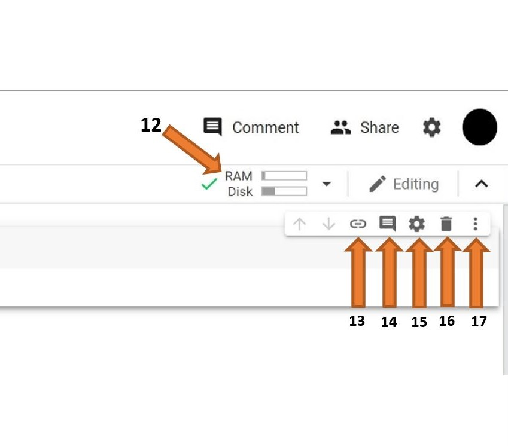

.. Copyright (C)  Google, Runestone Interactive LLC
   This work is licensed under the Creative Commons Attribution-ShareAlike 4.0
   International License. To view a copy of this license, visit
   http://creativecommons.org/licenses/by-sa/4.0/.

Using Google Colaboratory Notebooks
-----------------------------------

You may be using Google Colaboratory to run code and complete assignments.

Google Colab is a free Jupyter Notebook environment hosted by Google.
It has all the features of Jupyter Lab and more. It is a great platform
used by data scientists and machine learning programmers because it takes away the hassle of having to do installations on your own machine. Colab has
many data science libraries pre-installed and allows you to save your files on Google Drive.

Getting Google Colab Set Up
~~~~~~~~~~~~~~~~~~~~~~~~~~~

How do you set up this great tool?

To begin, go to the `Google Colab website`_ and sign in by clicking the blue button on the top right of the web page. You must have a Gmail account to use this tool.
If you do not already have a Gmail account, then you will have to create one.

.. _Google Colab website: https://colab.research.google.com/

Once you are signed in, you should see a pop-up box similar to the one shown below.

.. image:: Figures/colab_new_notebook.JPG
  :alt: Pop-up window to create a new notebook or open an existing one on google colab.

You can create a new notebook file by clicking on NEW NOTEBOOK, but for now, close the pop up by clicking on cancel
or by clicking on the shaded area outside of the pop-up. Another way of creating a new notebook is to click on the File tab (top left) -> New Notebook.
Notice that there are options for opening different files and uploading files, these will be important for later.

The UI
~~~~~~

Create a new Colab notebook following the steps provided in the above section.

Before we start getting into the coding, let's familiarize ourselves with the user interface (UI) of Google Colab.

**What the different buttons mean:**

.. image:: Figures/colab_UI_Left.JPG
  :alt: Left side Google Colab notebook with arrows pointing at different features.

1. **Files:** Here you will be able to upload datasets and other files from both your computer and Google Drive
2. **Code Snippets:** Here you will be able to find prewritten snippets of code for different functionalities like adding new libraries or referencing one cell from another.
3. **Run Cell:** This is the run button. Clicking this will run any code that is inserted in the cell beside it. You can use the shortcut shift+enter to run the current cell and exit to a new one.
4. **Table of Contents:** Here you will be able to create and traverse different sections inside of your notebook. Sections allow you to organize your code and improve readability.
5. **Menu Bar:** Like in any other application, this menu bar can be used to manipulate the entire file or add new files. Look over the different tabs and familiarize yourself with the different options.
   In particular, make sure you know how to upload or open a notebook and download the notebook (all of these options are under "File").
6. **File Name:** This is the name of your file. You can click on it to change the name. Do not edit the extension (.ipynb) while editing the file name as this might make your file unopenable.
7. **Insert Code Cell:** This button will add a code cell below the cell you currently have selected.
8. **Insert Text Cell:** This button will add a text cell below the cell you currently have selected.
9. **Cell:** This is the cell. This is where you can write your code or add text depending on the type of cell it is.
10. **Output:** This is the output of your code, including any errors, will be shown.
11. **Clear Output:** This button will remove the output.

12. **Ram and Disk:** All of the code you write will run on Google's computer, and you will only see the output. This means that even if you have a slow computer, running big chunks of code will not be an issue.
    Google only allots a certain amount of Ram and Disk space for each *user*, so be mindful of that as you work on larger projects.
13. **Link to Cell:** This button will create a URL that will link to the cell you have selected.
14. **Comment:** This button will allow you to create a comment on the selected cell. Note that this will be a comment on (about) the cell and not a comment in the cell.
15. **Settings:** This button will allow you to change the Theme of the notebook, font type, and size, indentation width, etc.
16. **Delete Cell:** This button will delete the selected cell.
17. **More Options:** Contains options to cut and copy a cell as well as the option to add form and hide code.

Let's try something fun. Do the following: go to Settings(#15) -> Miscellaneous, check the boxes that say Corgi mode, and Kitty mode. Click save.
Now wait a few seconds, keep an eye on the top of the web page. WARNING: Having this setting on might slow down your browser, so it is not recommended that
you leave them on while working on assignments or projects.

Colab Code Cells
~~~~~~~~~~~~~~~~

As you learned cells in a Jupyter Notebook can contain either text written in Markdown or Python 3 code. Of course, this is true in Google
Colab.

Clicking "run cell" on a code cell will execute the code in the cell.
The output, if there is one, will be shown directly below the cell. Try running this cell.

.. jupyter-execute::

   3+5*4%43

This doesn't work just for arithmetic operations but for any Python code that you
might write.

.. jupyter-execute::

   import math

   circle_areas = []

   for i in range(1, 5):
       circle_areas.append(math.pi * i**2)

   circle_areas

Notice that if the last line of a code cell is a value/variable, that value/variable will be
printed in the output. If the last line is an assignment of a value to a variable, then nothing
will be printed in the output. Alternatively, you may use a print statement (`print (<variable name>)`) to
see what is stored in the variable.

.. jupyter-execute::

   a = 5

Note that no output is produced when you run the above code cell. However, the
value of "a "is saved and is available in other cells. Here we have included a
print statement to show you what is stored in variable `b`.

.. jupyter-execute::

   b = a * a
   print (b)

This is useful because it means that we can put "import" statements and the
time-consuming reading of large data sources in one code cell usually at the start
of the notebook, and you can experiment with manipulations of that data in later cells
without having the wait to reload the data. The caveat to this is that each code cell
is executed only when you run it, so you could accidentally or willfully run code cells
out of order. Below is an example.

.. code-block:: python3

   # Run this cell once
   my_list = ["red", "green", "blue"]

.. code-block:: python3

   # Run this cell twice
   my_list.append("purple")

.. code-block:: python3

   # Run this cell once
   print(my_list)

.. code-block:: none

   ["red", "green", "blue", "purple", "purlple"]
   

Notice that ``my_list`` "contains "purple" twice; even the code above only adds it
once. In general, you should write your code assuming that each code cell is run once
from top to bottom. There's even a menu to help you do that. The "Run" menu has
"Run All Above Selected Cell" and "Run All Cells" functions that allow you to
get your notebook in a predictable state if you ever get confused by having run
cells multiple times or out of order.

Google Colab has preinstalled packages, modules, and libraries to make it easier for us to use it without
worrying about having to import or install the packages ourselves. As you might have noticed
in one of the code blocks above, "import math" allows you to utilize the math module
which includes summation and subtraction. As you go further in this chapter, you will
be importing other packages and libraries as well.

.. jupyter-execute::

   import pandas as pd
   import numpy as np
   import scipy as sc

Think of packages, libraries, and modules as separate files that exist outside of the one you are working on.
They are an efficient part of programming so programmers don't have to re-write every bit of code from scratch.
For instance, the math module already has addition and subtraction defined in it, so by importing it, you can build
on top of it rather than having to reinvent the wheel.

The "import "statement tells the program that you are going to be referencing things that do not exist in this file.
It also tells the program which file, among the files preinstalled in Colab, it is referring to. For example, "import
pandas as pd "tells the program that you will be using things from the pandas "file" (package) and that whenever you
type "pd" you are talking about the pandas package.

Some Python packages may not be preinstalled on Google Colab. For those you may use ``!pip install <package_name>``. The "! "is
important before the pip because it is telling Colab that the line is a terminal command and not python code.

You may notice a few lines appear telling you that your installation is happening. This means you are doing it right! Sometimes it
might be a few lines, and other times it might be many. The number of lines varies depending on how large the library, module, or package is.

.. jupyter-execute::

   !pip install str

Now that you have successfully installed it, you must import the file (module for str) before you are able to use it.

.. jupyter-execute::

   import str

Note that you can view a cell's source by double-clicking it or by pressing Enter to edit it while it is selected. You can also use Shift-Enter if you would like to re-render it. This can be very useful!
