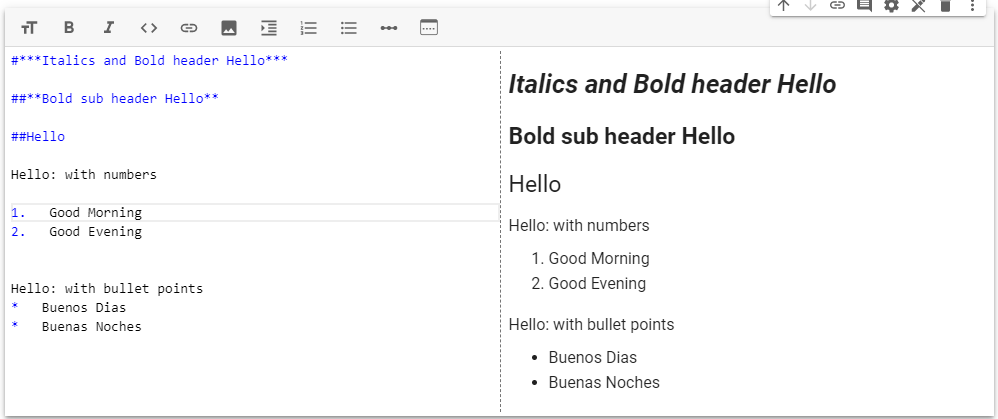

.. Copyright (C)  Google, Runestone Interactive LLC
   This work is licensed under the Creative Commons Attribution-ShareAlike 4.0
   International License. To view a copy of this license, visit
   http://creativecommons.org/licenses/by-sa/4.0/.

Jupyter Notebooks
=================

Jupyter Notebooks in data science allow for a mixture of runnable code and text. They are often used to create reports.
The interface is a virtual environment that resembles a real-life research notebook.
A form of literate programming, a Jupyter Notebook allows for the possibility of not only writing code but
also inspecting and documenting its results as a piece of writing that is understandable for
human beings. As you will learn later, the only way to document anything in a pure code
environment is to use comments and docstrings, which is not convenient for data scientists who need to report on their research in a way that
is readable and possibly updateable even by non-technical users.
So, a great advantage of a Jupyter Notebook environment is being able to combine both code and nicely
formatted text or graphics to easily document your work.

The industry standard of a Jupyter notebook environment is certainly the Jupyter Notebook itself, a free, open-source
interactive web-based computational Notebook. Though computational notebooks existed long
before Jupyter Notebook, its multi-language programming capabilities are what made it the
industry standard. Even its name, Jupyter, is an acronym for all of its coding languages -
Julia, Python, and R. Currently, there are many Notebook environments for the users to choose
from. In this book, we will highlight both the traditional Jupyter Notebooks and Google Colab Notebook environments.

Notebook Functionalities
------------------------

Most of the functionalities of Jupyter Notebooks occurs in cells.
Cells come into types: Text Cells and Code Cells.
In a compiled program, you would have to run the whole file if you wanted to test a snippet of code. With runnable code cells, you can
run individual code cells without worrying about the cells above or below it.

Text Cells
~~~~~~~~~~

There are multiple ways to customize a text cell in a Jupyter Notebook. In the image below you will see a few options that
are available.

There is an option to bold, italicize, add bullet points, add numbered lists, and toggle text(s) as headers using the clickable options.
There are many more options to customize your text cells if you use Markdown.

Markdown is a lightweight markup language that uses a plain text format which is used in programming to edit and present HTML, XHTML, pdf
and other file types. More about Markdown will be presented later in
this chapter.

Using Jupyter Notebooks
-----------------------

You will either choose to do an Anaconda installation of
Jupyter Notebooks on your own machine or you will choose to work in
Google Colaboratory Notebooks in the cloud. Each has advantages.

If you are in a course that is using this text, your instructor will
likely have you read one of two following sections.
