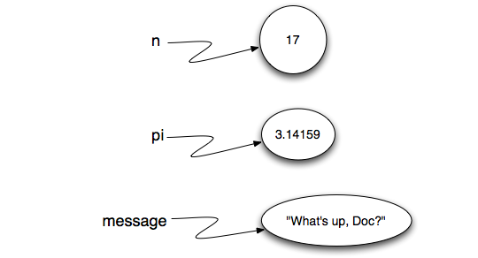

.. Copyright (C)  Google, Runestone Interactive LLC
   This work is licensed under the Creative Commons Attribution-ShareAlike 4.0
   International License. To view a copy of this license, visit
   http://creativecommons.org/licenses/by-sa/4.0/.

Python
======

Data types
----------

All information is stored as data and data are of a certain types.  Some data can be numbers or letters while others 
can simply be truth values (more on this below). It is important to differentiate data based on the kind of value it 
has stored to know how we can use it.

==============================
TALK ABOUT ATOMIC DATA TYPES
are not broken down into smaller parts by decimal points.
Floating point numbers are numbers that *are* broken down into smaller parts by decimal points. 
==============================

**numeric data types:**

There are two main types of numeric data in Python. Integers (``int``) and floating-point values (``float``).
Integers are positive or negative numbers that do not have fractional components to the right of the decimal point. 
Floating-point numbers are numbers that have fractional components after the decimal points. As a good rule of thumb, 
if it has a decimal point, it is a ``float``. If the number does not contain a decimal point, it is an ``int``. 
The number 12 is an ``int``, but 12.0 is a ``float``, even if the numbers seem to represent the same value, 
they can be of different data types.

You can use both ``int``s and ``float``s to perform basic mathematical operations such as addition (+), subtraction 
(-), multiplication (*), division (/), and exponentiation (**). Python will automatically use the normal order of operations 
when calculating a value. You can use parentheses to force Python to evaluate certain expressions first. 

-------------------------------
Python has some unique operations like remainder (modulo) (%) and integer division (//). The remainder
operator, as you might expect, will return the remainder of two numbers. Integer division will return all numbers that
appear before the decimal point. Integer division is particularly important because a normal division of ``int`` values 
will return a ``float``. If you want an ``int`` as the return value, you must use integer division.
------------------------------

.. activecode:: int_and_float
   :coach: 
   
   print(7+2*3)
   print((7+2)*3) # The parentheses change the order in which python evaluates the mathematical expression
   print(3**5)
   print(5**20)
   print(9/4)
   print(7/9)
   print(7//9)
   print(7%9)
   print(4/9)
   print(4//9)
   print(4%9)

~~~~~~~~~~~~~~~~~~~~~~~~~~~~~~~~~~~~~~~~~~~~~~~~~~~~~~~~~~~~~~~~~~~~~~~~~~~~~~~~~~~~~~~~~~~~~
Two numeric data classes (types): ``int`` and ``float``
both can be used with +,-,*,/, and ** (power) to perform calculations
python will automatically use the order of operation. You can also use parentheses to 
specify the order of operation, just like in regular math.

Python also has two different operands: % and //. 
% this is the modulo operand. This divides two numbers and returns the remainder.
// this operation is called floor division. This will only return the integer portion of the division, with no decimal points.
~~~~~~~~~~~~~~~~~~~~~~~~~~~~~~~~~~~~~~~~~~~~~~~~~~~~~~~~~~~~~~~~~~~~~~~~~~~~~~~~~~~~~~~~~~~~

**Boolean data types:**
~~~~~~~~~~~~~~~~~~~~~~~~~~~~~~~~~~~~~~~~~~~~~~~~~~~~~~~~~
two types of Boolean values: ``True`` and ``False``
they are used to check the truth of a statement.
the following opreations can be applied to Boolean values ``or``, ``and``, and ``not``
~~~~~~~~~~~~~~~~~~~~~~~~~~~~~~~~~~~~~~~~~~~~~~~~~~~~~~~~~~~~~~

Boolean (``bool``) is another data type that is very useful in programming. They are used to check 
the truth of an expression in python. Booleans return ``True`` or ``False``. You can evaluate 
multiple Boolean expressions using the following operations: ``and``, ``or``,and ``not``.

::

    >>> True
    True
    >>> False
    False
    >>> False or True
    True
    >>> not (False or True)
    False
    >>> True and True
    True

Boolean values are often used with other operators such as equal (==) or less than (<). It is possible 
to combine these relational operators with logical operators (``and``, ``or``, and ``not``) to form
complex logical questions. Below is a table of all of the logical and relational operators that 
can be used to create Boolean expressions.

.. _tab_relational:

.. table:: **Table 1: Relational and Logical Operators**

    =========================== ============== =================================================================
             **Operation Name**   **Operator**                                                   **Explanation**
    =========================== ============== =================================================================
                      less than    :math:`<`                                                Less than operator
                   greater than    :math:`>`                                             Greater than operator
             less than or equal   :math:`<=`                                    Less than or equal to operator
          greater than or equal   :math:`>=`                                 Greater than or equal to operator
                          equal   :math:`==`                                                 Equality operator
                      not equal   :math:`!=`                                                Not equal operator
                    logical and  :math:`and`                          Both operands True for result to be True
                     logical or   :math:`or`        One or the other operand is True for the result to be True
                    logical not  :math:`not`   Negates the truth value, False becomes True, True becomes False
    =========================== ============== =================================================================

.. activecode:: bool
   :coach:

   print(13==50)
   print(15 > 10)
   print(not(15  > 10)
   print((5 >= 1) and (5 <= 15))

~~~~~~~~~~~~~~~~~~~~~~~~~~~~~~~~~~~~~~~~~~~~~~~~~~~~~~~~~~~~~~~~~~~~~~~~~~~~~~~~~~~~~~~~~~

There is also one more Boolean operator you might have noticed, the ``==``. It is different from ``=`` because it is not used to assign value but 
rather to check equality between two values.  

--------------------------------------------------------------------------------------------------------------
you might have noticed that == is used to check equality. Why is that? Why not just use the equals sign (=)?
This is because = already has a purpose in Python. = is uesd to assign variables.
--------------------------------------------------------------------------------------------------------------

**Variables**

Think of Variables as a listing of houses in an address book. You can look at the address book and find out where a house is located 
but the house itself is not on the address book, that would be a very heavy book. Similarly, variables store the location of a particular
value. When a variable is created, python will save the value in your computer's memory and store that location in the variable.
When you run the code, python will help you out by going to the address and accesing the value.

In order to use a variable, you must give it a name. It can have any name that has alphanumeric (A-Z,a-z,0-9) characters and including 
underscore (_). The name cannot start with a number. The name given to a variable is case sensitive. In the example 
below `n`, `pi`, and `message` are variables.

.. code:: python3

   n = 17
   pi = 3.14159
   message = "What's up, Doc?"
   

----------------------------------------------------------------------------------------------------------------
Variables are letters or words that contain a value. Imagine each cell inside of google sheets to be a variable.
The name of the cell can be A1 A2 A3 and so on, are our variable names. and the ADD MORE

When you use variables in your code python will go to the location listed in the variable and access the values.

Think of Variables as a listing in an address book. You can look at the address book and find out where the variables are located 
but the location of the file is not found wherever the address is written. The variable tells python 
where the file is stored and python access it during runtime.
---------------------------------------------------------------------------------------------------------------

**Collection Data Types**

intro

**lists**
----------------------------------------------------------------------------------
A list is an ordered collection of zero or more references to Python data objects. 
contain series of data objects, hetero genous, and can be empty

Items in a list are ordered based on how they are placed when the list is created or how they are added. 

There is the first item and there is the last item.

The members of a list are ordered based on when certain items are added to the list. 
The order in which the different elements appear in a list is set when the list is created?............

The order of members of a list is the inate property of that list. 

This means that the order you input things into a list is the order 
they will stay in unless they are reordered.

you can add or remove members from the list.
----------------------------------------------------------------------------------

A list is a **heterogeneous**, **mutable** and ordered collection of references to values. 

Lists can contain more than one kind of data types (int, float, bool, etc.), hence they are heterogeneous. 
They are also mutable meaning that you can change specified values in a list by reordering, adding or removing them.

.. code:: python3

   my_list = ["string", 1, [5.0, 4.5], 5.6]  # A list containing multiple data type references
   my_list = []                              # Lists can be empty too
   my_list = [3, 4, 6, 2, 45, 23, 12, 34]    # A list containing a single data type references

One of the proprties of a list is that it is ordered sequentially. This means that we can find the first, second, 
third,... items in the list. Each item in a list is called an **element**. Since a list is ordered sequentially, 
you can use sequential operations listed in the following table.

.. _tab_sequentialmethods:

.. table:: **Table 2: Operations on Any Sequence in Python**

    =========================== ============== ========================================
             **Operation Name**   **Operator**                          **Explanation**
    =========================== ============== ========================================
                       indexing            [ ]          Access an element of a sequence
                  concatenation             \+          Combine sequences together
                     repetition             \*   Concatenate a repeated number of times
                     membership             in     Ask whether an item is in a sequence
                         length            len  Ask the number of items in the sequence
                        slicing          [ : ]             Extract a part of a sequence
    =========================== ============== ========================================

In order to access items in a list you must use the index of the item. The first item in a list has an index of 0 and every 
item after it has an index that increases by one.  

.. code:: python3

   my_list[0]
   my_list[1]
   my_list[2]
   my_list[4]
   my_list[6]
   my_list[7]

.. parsed-literal::

   3
   4
   6
   45
   12
   34

You can use negative indexes to refer to values starting from the end of the list.

.. code:: python3

   my_list[-1]
   my_list[-2]

.. parsed-literal::

   34
   12

You can also use slices to rapidly grab portion of the list.

.. code:: python3

   my_list[0:2]

.. parsed-literal::

   [3, 4]

Notice that the slicing grabbed element 0 and element 1 but not element 2. Slicing will grab items starting from 
a certain index up to, but not including, another index.

.. _tab_listmethods:

.. table:: **Table 3: Methods Provided by Lists in Python**

    ======================== ========================== =======================================================
             **Method Name**                    **Use**                                         **Explanation**
    ======================== ========================== =======================================================
                  ``append``    ``a_list.append(item)``                    Adds a new item to the end of a list
                  ``insert``  ``a_list.insert(i,item)``           Inserts an item at the ith position in a list
                     ``pop``           ``a_list.pop()``             Removes and returns the last item in a list
                     ``pop``          ``a_list.pop(i)``              Removes and returns the ith item in a list
                    ``sort``          ``a_list.sort()``                            Modifies a list to be sorted
                 ``reverse``       ``a_list.reverse()``                  Modifies a list to be in reverse order
                     ``del``          ``del a_list[i]``                    Deletes the item in the ith position
                   ``index``     ``a_list.index(item)``   Returns the index of the first occurrence of ``item``
                   ``count``     ``a_list.count(item)``           Returns the number of occurrences of ``item``
                  ``remove``    ``a_list.remove(item)``                Removes the first occurrence of ``item``
    ======================== ========================== =======================================================

----------------------------------------------------------------------------
Since lists are considered to be sequentially ordered, they support a number 
of operations that can be applied to any Python sequence. Table 2 reviews 
these operations and the following session gives examples of their use.

Immutable means that they can not be altered once they are created.
----------------------------------------------------------------------------
-------------------------------------------------------------------------------------------------------------------------------------
Since lists are considered to be sequentially ordered, they support a number of operations that can be applied to any Python sequence.
--------------------------------------------------------------------------------------------------------------------------------------

**Strings**

use quotes (single or duble) to specify a string. strings are sequence of characters. characters
are any letter number or symbol.

Strings are another data type. 
Strings are sequential collections of zero or more **characters**. Once a string is created it cannot be 
altered, hence it is **immutable**.
You can slice or access particular elements of a string by using the sequential indexing 
operations you used for lists in :ref:`Table 2 <_tab_sequentialmethods>`.

-------------------------------------------------------------------------------------------------------------
Strings are sequential collections of zero or more letters, numbers and other symbols. We call these letters, 
numbers and other symbols characters. Literal string values are differentiated from identifiers by using 
quotation marks (either single or double).

Unlike lists, which you will see next, strings are immutable. This means...

The location of the value is in your computer's memory.
-------------------------------------------------------------------------------------------------------------

.. _tab_stringmethods:

.. table:: **Table 4: Methods Provided by Strings in Python**

    ======================== ========================== =============================================================
             **Method Name**                    **Use**                                               **Explanation**
    ======================== ========================== =============================================================
                  ``center``     ``a_string.center(w)``            Returns a string centered in a field of size ``w``
                   ``count``   ``a_string.count(item)``   Returns the number of occurrences of ``item`` in the string
                   ``ljust``      ``a_string.ljust(w)``      Returns a string left-justified in a field of size ``w``
                   ``lower``       ``a_string.lower()``                             Returns a string in all lowercase
                   ``rjust``      ``a_string.rjust(w)``     Returns a string right-justified in a field of size ``w``
                    ``find``    ``a_string.find(item)``         Returns the index of the first occurrence of ``item``
                   ``split`` ``a_string.split(s_char)``                 Splits a string into substrings at ``s_char``
    ======================== ========================== =============================================================

**range**

takes three parameters param1: start plave param2: end place param3: skipping
can be used with iterable objects

**Tuples**
basically the same as lists but immutable
-----------------------------------------------------------------------------------------------------------
Tuples are very similar to lists in that they are heterogeneous sequences of data. The difference is 
that a tuple is immutable, like a string. A tuple cannot be changed. Tuples are written as comma-delimited 
values enclosed in parentheses. As sequences, they can use any operation described above
-----------------------------------------------------------------------------------------------------------

**Sets**
heterogenous data that is not in a series. sets are muteable but cannot be indexed or sliced.
-----------------------------------------------------------------------------------------------------------
A set is an unordered collection of zero or more immutable Python data objects. Sets do not allow duplicates 
and are written as comma-delimited values enclosed in curly braces. The empty set is represented by set(). Sets 
are heterogeneous, and the collection can be assigned to a variable as below.
-----------------------------------------------------------------------------------------------------------

**Dictionaries**

-----------------------------------------------------------------------------------------------------------
Dictionaries are collections of associated pairs of items where each pair consists of a key and a value. This 
key-value pair is typically written as key:value.It is important to note that the dictionary is maintained in 
no particular order with respect to the keys. 

-----------------------------------------------------------------------------------------------------------

table 7

table 8

**inputs**
There are times when we want to interact with the user to get data or provide some sort of result. Python 
gives us a handy function that allows us to do this; this function is called ``input``. The input function allows us to
ask the user to enter some data, and in return, we get a reference to that data in the form of a string. This function
takes in a string as a parameter and is usually called the prompt because it is the text that asks the user to enter
some information. For example:

.. code:: python3
   
   your_name = input("Please enter you full name: ")

There are a few things to notice here. After the user types in their name after the prompt, their answer will be stored in the 
``your_name`` variable. Since we can store the users' answers in variables, we can instruct users for their input and 
incorporate it in the future. For example, we can use the information that the user provided above and use it. 

.. code:: python 3

   print("We can lowercase your name " + your_name.lowercase() + " or uppercase your name " + your_name.uppercase())

Another thing to notice is the spaces that we have in our print statements. These are required so we can have nice formating. 
If we had no spaces, we would have something like this: ``We can lowercase your nameyour_nameor uppercase your nameyour_name``.  

Like mentioned, the ``input`` function will be a string representation of the exact characters that were entered after the prompt.
However, we can turn these strings into different variable types. We can do this as follows.

.. code:: python3

   pie = input("What is the numeric representation of pie? ")
   numeric_pie = float(pie)
   sphere = numeric_pie * 3 ^ 2

In the above code, we asked the user to input the numeric representation of pie. Their answer will be stored in the variable pie. Then
we make a new variable named numeric_pie where we convert pie into a float. Since we changed it to a float, we can then use it in 
the sphere formula as we did above. 

**for loops**
``for`` loops are used to repeat an action until a specific condition is met. 
A common use of the``for`` statement is to iterate over the elements of a collection as long as the collection is a sequence. For instance,

.. code:: python3
  for item in [1, 2, 3, 4, 5]:
  print(item)

.. parsed-literal::
   
   1
   2
   3
   4
   5

Another common use of the ``for`` loop is to implement definite iteration over a range of values. For example,

.. code:: python3

   for item in range(6):
   print(item * 2)
   
.. parsed-literal::
   
   0
   2
   4
   6
   8
   10

**conditionals**