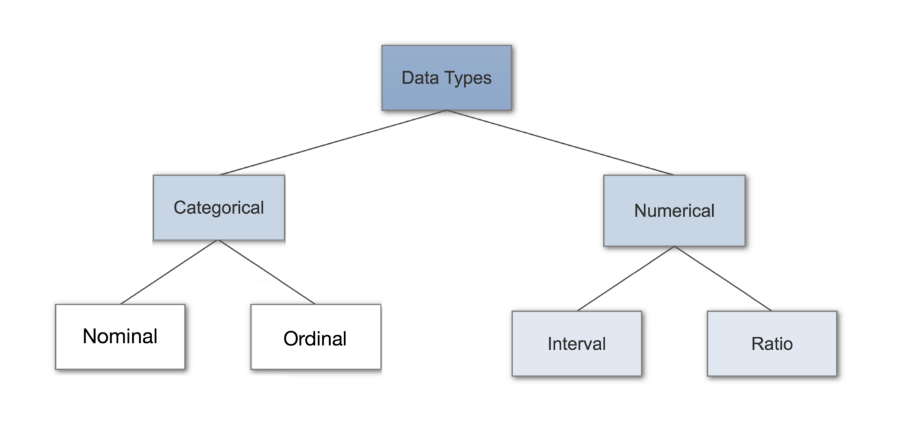
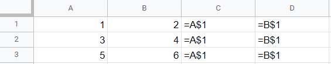
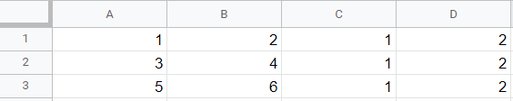
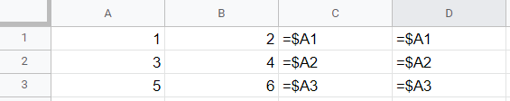
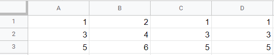

.. Copyright (C)  Google, Runestone Interactive LLC
   This work is licensed under the Creative Commons Attribution-ShareAlike 4.0
   International License. To view a copy of this license, visit
   http://creativecommons.org/licenses/by-sa/4.0/.

Case Study 2: Business Start-Up Analysis in Different Countries
===============================================================

Data science and data analytics can be used to analyze and understand data related to many different fields,
such as education, business, targeted advertising, healthcare, and many more.
In this case study, we will explore a data set
related to starting a business.

Analyzing Business Start-Ups
----------------------------
On the following section, we will import the provided dataset into Goolge sheets following the :ref:`instuctions <googlesheet_setup>` from a previous chapter. 
We will use **Google Sheets** to explore which of these indicators are most important to start a new business in each economy's largest cities. 

This case study utilizes the starting a business dataset `Start_a_Business_2019.csv <../_static/Start_a_Business_2019.csv>`_ ,also called business start-up, obtained from the Doing Business-World Bank website.
The data set contains indicators from over 190 countries that measure the relative ease of starting a business in those countries. The data set looks at
two limited liability companies in various regions and countries around the world related to the ease of starting a business in different countries.

Each country in the data set measures things such as the minimum amount of capital investment an entrepreneur must have to start a business,
and the number of procedures that are necessary to register the business, and more that will be covered throughout this case study.

The ease of starting a business for each country is measured on a scale of 0-100. A score of zero represents the country with the lowest performance
while 100 represents the country with the highest performance.

Below are definitions of the indicators found in the data set.

-  **Starting a Business Rank:** Countries are ranked on a score representing the relative ease of starting a business.
-  **Starting a Business Score:** These scores are calculated using the simple average of all the indicators' scores.
-  **Procedures:** The activities that must be accomplished to get the business registered with its associated governmental entity.
-  **Time (days):** The median number of days needed to get the business up and running for each country/region.
-  **Cost:** The amount of money that must be expended to get the business started (such as official, legal, and professional services fees, etc.).
-  **Paid-In Minimum Capital:** The minimum amount of money the entrepreneur must have in the bank for the business registration process to be completed.
-  **Income Level:** This represents the income levels of each country's economy. This indicator is divided into low, lower-middle, upper-middle, and high, based on a country's gross national income (GNI) per person.

Now, let's revise what we have learned from Chapter 2.1. Based on `Data Types in Statistics <https://towardsdatascience.com/data-types-in-statistics-347e152e8bee>`_ article, in order to categorize different types of variables, we split them into Categorical and Numerical Data. 

Categorical data describe charateristics of the variables, and can be further split into Nominal and Ordinal. Some examples of categorical data are eye color, social class, etc. 
Nominal values represent discrete units and are used to label the variables, which have no quantitative value. An example of nominal data is eye color (blue, brown, black).
Ordinal data are values that are ordered discrete characteristics. An example of ordinal data is social class (lower, middle, upper).

As for the numerical data, we include quantitaive data, and they are seperated into interval and ratio data. Some examples of numerical data are height, weight, income.
Interval values represent ordered categories that have the equal difference. Interval data do not have a "true zero". Some examples of interval values are the temprature or income.
Ratio values are also ordered categories that have the equal difference and can have a "true zero". Some examples of ratio data are height, length, or weight.

The following picture is a great way to determine to determine to which category a variable belongs.

Numerical Data can also be seperated into discrete and continuous. Discrete are data that can be classified and also counted. Some discrete data are the number of students in a class, or someone's shoe size.
Continuous data can't be counted but they can be measured. An example of continuous data is a person's height.

.. mchoice:: dat_sab1

   Identify and select the columns in the business start-up dataset that represent categorical (nominal) data?

   - Business Start-Up Rank

     - Incorrect

   - Income Level

     + Correct

   - Business Start-Up Score

     - Incorrect

   - Procedure – Men (number)

     - Incorrect

Business Start-Up Analysis in Different Countries
-------------------------------------------------

The research questions below are interesting questions that can be addressed using data analysis. Using data analytics techniques we will be able to explore some of these
research questions questions throughout the book. 

1. What are the different factors that lead to a high ranking in the business start-up dataset?
2. What role does “income level” play in determining the rank of a country?
3. What factor, on average, contributes most/least to the business start-up rank?
4. What similarities and differences do the countries experiencing the highest/lowest business start-up rank have? Are there any discrepancies between different score factors of countries with similar rankings?
5. For the countries with the largest change, which factors changed the most? Are these factors the same as you identified in the first 3 questions?

The data set lists countries based on their business start-up scores. While it is easy to
see the best countries for starting a business based on the business start-up rank, it is not
easy to grasp the relative simplicity of each country. 

Descriptive Statistics
-----------------------

The following are some very important terms in data analytics that are used to describe the dataset. 

**Mean** is the average of a set of values. It is important in analytics as it is a measure of central tendency. In Google Sheets we use the function ``AVERAGE`` and then select the cells of the values values to find the mean.
From now on we will use the words mean and average interchangeably. 

**Range** is the difference between the lowest and highest values of the dataset. To find the maximum value you use the function ``MAX``. Similarly, to find the minimum value you use the
function ``MIN``.

**Standard deviation** is the average distance from the mean. It shows how spread out the data is more than other types of variabilities. To find the standard deviation we use the
the function ``STDEV``.

**Mode** is the most common value on the dataset. It is very important in categorical data because it describes the most frequent option. To find the mode you can use the function 
``MODE``.

**Median** is the middle value of the dataset. The median is also as important because it provides another kind of baseline besides mean and mode. The function that gives the median is ``MEDIAN``.

**Pearson correlation** is a type of measurement; it measures the strength and direction of a linear relationship between two variables. The Pearson correlation coefficient takes values from -1 to 1. 
The value of -1 means it has a strong negative relationship, and the value of +1 means it has has a strong positive relationship.

Another important formula for Google Sheets is Cell Refrencing ``$``. The dollar sign ``$`` can be used before the column and/or row of a reference to control how the reference will be updated when copied to a row or collumn.
The dollar sign causes the reference's relevant component to remain unaltered.
For example, this will keep the row number the same.  Here is the example of the formulas if we write the formula ``=A$1`` in C1 and grab it down and to the right:

This shows that it hold the row number constant as we move it along the rows and columns. Here are the results:

If we drag the formula ``=A$1`` from cell C1 through cell C3, it keeps the same column as we have not changed column but it also does not change the one since A1 is 1. If drag the formula ``=A1`` from cell C1 through cell C3,
it keeps the same column as we have not changed column but in this case cell C1 will have the formula ``=A1``, cell C2 will have the formula ``=A2`` and cell C3 will have the formula ``=A3``, and the results will change to 1, 3, and 5 respectively.

Similarly, this will keep the column number the same. Here is the example of the formulas if we write ``=$A1`` in C1 and drag it down and to the right:

This shows that it hold the column number constant as we move it along the rows and columns. Here are the results:

Here, when we drag the formula from cell C1 to cell C3 it keeps the column constant and it changes the row number. However when we grab C1 to D1 the formula remains the same because the column remains constant becasue of the ``$`` and the row remains the same.
If we had the formula ``=A1`` in C1 and we drag it to D1 then the column name will change to ``=B1``.

We can use the functions that we learned in the previous case study to create a common baseline: average, standard deviation, and median. So, let's average
the business start-up score of all countries together.

a. Use the ``AVERAGE`` function to calculate the mean in column D. Scroll down and click on a cell in column 194.
   There should be an empty cell below the column of numbers for the business start-up score. Now type ``=AVERAGE(D2:D192)``.
   You can also type ``=AVERAGE(`` and then click and drag the numbers you want. ``D2:D192`` specifies a range, from Column D Row 2
   down to Column D Row 192.

b. Many formulas in Google Sheets use ranges. They can span cells in a single column, single row, and they can span
   rows and columns, which form a rectangular shape. Try it yourself, calculate the range of:

   - E2:O2
   - E2:E192
   - E2:L192

c. Calculate the ``STDEV`` and ``MEDIAN`` for the business start-up score column.

d. Calculate the standard deviation and median by copying and pasting the formula to other columns.

e. Copy the formula for ``=AVERAGE(D2:D141)`` from a, and the formula for standard deviation from c 

f. Remember, use a ``$`` so Google Sheets will not change the cell references when copy/pasting. 

Then calculate the following:

.. fillintheblank:: fb_sab8

   What is the mean value for the GNI? |blank|

   - :14173.141: Is the correct answer
     :14173.1413: Remember to round up and include three digits to the right of the decimal point
     :14173.14136: Remember to round up and include three digits to the right of the decimal point
     :14173: Remember to include three digits to the right of the decimal point
     :x: USE the ``MEDIAN`` function and the range from N2 to N192

.. fillintheblank:: fb_sab8_1

   What is the standard deviation for the GNI? |blank|

   - :20720.786: Is the correct answer
     :20720.78597: Remember to round up and include three digits to the right of the decimal point
     :20721: Remember to include three digits to the right of the decimal point
     :x: USE the ``STDEV`` function and the range from N2 to N192

More Data Analytics
-------------------

When you have a data set covering the entire world, it can be interesting to identify certain information. For instance,
you can calculate which countries have the largest or smallest Gross national income (GNI), the income per capita of women and men, and so on.

Remember, finding the maximum value of a column does not mean we know which country it corresponds to. Therefore, we can use the ``MATCH`` and ``INDEX`` function to fix this problem. Let's find what country corresponds to the maximum value of GNI. First, calculate the maximum GNI in cell M193, then in cell M194 type ``=MATCH(M193, M2:M192, 0)``.
Notice that the match function searches for the value in cell M193 in the range ``M2:M192``, and the 0 tells Google Sheets that the data is not sorted. The 0 is
important because, without it, sheets will assume the data is sorted and will stop when it finds a value greater than the value in M194.

Type ``=INDEX(A2:A192, M194)`` in cell M195. The ``A2:A192`` parameters is the range from which ``INDEX`` will return a corresponding value; in this
case, it is the location. M194 from the previous question is ``=MATCH(M193, M2:M192, 0)``. So the ``INDEX`` is practically telling sheets to find the
location, from column A, that is found in the same row as the maximum value.

All three steps shown above can be performed in a single cell. Let’s look at the country that has the lowest Procedure Men number.
In cell E193 type ``=INDEX($A2:$A141, MATCH(MIN(E2:E141), E2:E141, 0))``. The ``MATCH`` and ``MIN`` functions both return one value.
So, sheets will first find the minimum value in cells ``J2:J141``. Then it will use the ``MATCH`` function to find the cell location (column and row)
of where that minimum value is. Finally, it will use the ``INDEX`` function to find what value from ``A2:A141`` matches up with the given parameters. Try
this and see what it returns. It should return New Zealand, its region, business start-up rank, and business start-up score.

Practice using the functions you have learned by finding the names of locations for other columns.If you want to copy/paste, check the ranges carefully and add the ``$`` sign to avoid running into errors.

You may be wondering if there is a **correlation** between a country’s ease of starting a business score and GNI or procedure.
One way to check this is to use the ``CORREL`` function to see how the score is affected by each factor i.e., business start-up score to GNI,
business start-up score to the procedure, business start-up score to time.

a. We can use the ``CORREL`` function to calculate the **Pearson correlation** between two ranges of data. Remember to use the ``$`` sign to anchor the
   column and the values in the business start-up data set ``$D$2:$D192``, so it doesn’t change when it is copy-pasted to use for other columns.

b. Repeat the above exercise by changing or copy-pasting it to different columns to see the correlation with other factors listed.

5. To better understand what leads a country to have a high score in creating a business, calculate the top
and bottom 20 countries' correlation scores. Are there any interesting results?

a. Calculate the mean of each factor for the top 20 countries, then do so for the bottom 20 countries. Calculate the difference
   in those averages for each of the factors for the top and bottom 20 countries. Which factors have the most impact on
   the business start-up score?

Data Visualization
-------------------

Visualizing the data is a great way to begin to interpret the data because doing so  allows the viewer to easily see trends or find outliers.
A **histogram** is one way to visualize the standard deviation of a particular data set. 

Another great way of visualizing data is to use a **choropleth**. As you know, a choropleth takes in a set of geographic data and uses a map
to show another set of data, such as business start-up score.

a. Click on Insert then select Chart

b. On the new Chart editor section, click on Chart Type and select Geo Chart

c. Select location column (``A2:A192``) as the region and any column that you wish to see as the Color.

d. You may hover around each country to see its respective statistic.

While using the choropleth, you might have noticed some outliers in the data, for example, South Africa has one of the lowest cost
of starting a business but is ranked 139. The countries above and below South Africa have a cost of 5 and 5.7 while South Africa has a
cost of 0.2.

a. For all countries, compute the countries' average cost immediately above and below it and subtract that from the chosen
   country’s average cost. Store your findings in a new separate column called Average Cost.

b. Use conditional formatting to help visually pick out the outliers.

c. Sort the data by selecting the average cost column containing the average costs, clicking on the Data Tab and select the Sort sheet by A -> Z.

**Lesson Feedback**

.. poll:: LearningZone_2_1_sab
   :option_1: Comfort Zone
   :option_2: Learning Zone
   :option_3: Panic Zone

   During this lesson I was primarily in my...

.. poll:: Time_2_1_sab
   :option_1: Very little time
   :option_2: A reasonable amount of time
   :option_3: More time than is reasonable

   Completing this lesson took...

.. poll:: TaskValue_2_1_sab
   :option_1: Don't seem worth learning
   :option_2: May be worth learning
   :option_3: Are definitely worth learning

   Based on my own interests and needs, the things taught in this lesson...

.. poll:: Expectancy_2_1_sab
    :option_1: Definitely within reach
    :option_2: Within reach if I try my hardest
    :option_3: Out of reach no matter how hard I try

    For me to master the things taught in this lesson feels...
