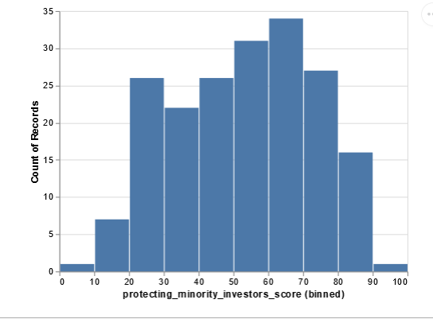

.. Copyright (C)  Google, Runestone Interactive LLC
   This work is licensed under the Creative Commons Attribution-ShareAlike 4.0
   International License. To view a copy of this license, visit
   http://creativecommons.org/licenses/by-sa/4.0/.

Case Study 2: Analyzing Protecting Minority Investors
======================================================

In this section, we will walk you through the process of analyzing and inspecting data. We 
will go over the process of modeling and visualizing a data set with a different set of tools. 
For this case study, we will use the World Bank Data on Protecting Minority Investors which was 
provided to you in the introduction.

Loading Minority Investors Data into a DataFrame
-------------------------------------------------

To get our first glimpse at **Pandas** and its capabilities, we will be using the data about the countries we used in the spreadsheet module. 
In the following block of code, you will see the first few lines of the raw CSV file for this project. 
It may look intimidating, but we will unpack it as we go. 

.. code-block:: none
   
   location,protecting_minority_investors_rank,protecting_minority_investors_score,strength_of_minority_investor_protection_index_(0-50),extent_of_disclosure_index_(0-10),extent_of_director_liability_index_(0-10),ease_of_shareholder_suits_index_(0-10),extent_of_shareholder_rights_index_(0-6),extent_of_ownership_and_control_index_(0-7),extent_of_corporate_transparency_index_(0-7),starting_a_business_score
   Afghanistan,140,36.0,18,8.0,1.0,9.0,0.0,0.0,0.0,92
   Albania,111,46.0,23,9.0,7.0,7.0,0.0,0.0,0.0,91.8
   Algeria,179,20.0,10,4.0,1.0,5.0,0.0,0.0,0.0,78
   Angola,147,32.0,16,4.0,6.0,6.0,0.0,0.0,0.0,79.4

In case we have forgotten, here is the `link <https://runestone.academy/runestone/static/fopp/Files/ReadingCSVFiles.html>`_ to the documentation 
on how to read and parse CSV files with Python.

.. code:: python3

   %matplotlib inline

   import pandas as pd
   import matplotlib
   import matplotlib.pyplot as plt
   import psycopg2
   import textatistic
   import seaborn as sbn
   from altair import Chart, X, Y, Color, Scale
   import altair as alt
   from vega_datasets import data
   import requests
   from bs4 import BeautifulSoup
   matplotlib.style.use('ggplot')
   # for plotly py.offline.init_notebook_mode()

First, let's read the protecting minority investors CSV file using Pandas ``read_csv`` function.

.. code:: python3

   wd = pd.read_csv('protecting_minority_investors.csv')

.. code:: python3

   wd.head()
   

.. raw:: html

    

    
    <table class="table table-bordered table-hover table-condensed">
    <thead><tr><th title="Field #1"></th>
    <th title="Field #2">location</th>
    <th title="Field #3">protecting_minority_investors_rank</th>
    <th title="Field #4">protecting_minority_investors_score</th>
    <th title="Field #5">strength_of_minority_investor_protection_index_(0-50)</th>
    <th title="Field #6">extent_of_disclosure_index_(0-10)</th>
    <th title="Field #7">extent_of_director_liability_index_(0-10)</th>
    <th title="Field #8">ease_of_shareholder_suits_index_(0-10)</th>
    <th title="Field #9">extent_of_shareholder_rights_index_(0-6)</th>
    <th title="Field #10">extent_of_ownership_and_control_index_(0-7)</th>
    <th title="Field #11">extent_of_corporate_transparency_index_(0-7)</th>
    <th title="Field #12">starting_a_business_score</th>
    </tr></thead>
    <tbody><tr>
    <td align="right">0 </td>
    <td>Afghanistan </td>
    <td align="right">140.0 </td>
    <td align="right">36.0 </td>
    <td align="right">18 </td>
    <td align="right">8.0 </td>
    <td align="right">1.0 </td>
    <td align="right">9.0 </td>
    <td align="right">0.0 </td>
    <td align="right">0.0 </td>
    <td align="right">0.0 </td>
    <td align="right">92.0</td>
    </tr>
    <tr>
    <td align="right">1 </td>
    <td>Albania </td>
    <td align="right">111.0 </td>
    <td align="right">46.0 </td>
    <td align="right">23 </td>
    <td align="right">9.0 </td>
    <td align="right">7.0 </td>
    <td align="right">7.0 </td>
    <td align="right">0.0 </td>
    <td align="right">0.0 </td>
    <td align="right">0.0 </td>
    <td align="right">91.8</td>
    </tr>
    <tr>
    <td align="right">2 </td>
    <td>Algeria </td>
    <td align="right">179.0 </td>
    <td align="right">20.0 </td>
    <td align="right">10 </td>
    <td align="right">4.0 </td>
    <td align="right">1.0 </td>
    <td align="right">5.0 </td>
    <td align="right">0.0 </td>
    <td align="right">0.0 </td>
    <td align="right">0.0 </td>
    <td align="right">78.0</td>
    </tr>
    <tr>
    <td align="right">3 </td>
    <td>Angola </td>
    <td align="right">147.0 </td>
    <td align="right">32.0 </td>
    <td align="right">16 </td>
    <td align="right">4.0 </td>
    <td align="right">6.0 </td>
    <td align="right">6.0 </td>
    <td align="right">0.0 </td>
    <td align="right">0.0 </td>
    <td align="right">0.0 </td>
    <td align="right">79.4</td>
    </tr>
    <tr>
    <td align="right">4 </td>
    <td>Antigua and Barbuda </td>
    <td align="right">79.0 </td>
    <td align="right">58.0 </td>
    <td align="right">29 </td>
    <td align="right"></td>
    <td align="right"> </td>
    <td align="right"> </td>
    <td align="right"> </td>
    <td align="right"> </td>
    <td align="right"> </td>
    <td align="right"> </td>
    </tr>
    </tbody></table>

Describing Minority Investors
-----------------------------

- Location
- Protecting Minority Investors rank
- Protecting Minority Investors score
- Strength of minority investor protection index (0-50)
- Extent of director liability index (0-10)
- Ease of shareholder suits index (0-10)
- Extent of shareholder rights index (0-6)
- Extent of ownership and control index (0-7)
- Extent of corporate transparency index (0-7)

Let's use our handy method that Pandas provides us with, ``describe``, to get some statistical data.

.. code:: python3

   wd.describe()

.. raw:: html

    

    
        <table class="table table-bordered table-hover table-condensed">
        <table class="table table-bordered table-hover table-condensed">
        <thead><tr><th title="Field #1"></th>
        <th title="Field #2">protecting_minority_investors_rank</th>
        <th title="Field #3">protecting_minority_investors_score</th>
        <th title="Field #4">strength_of_minority_investor_protection_index_(0-50)</th>
        <th title="Field #5">extent_of_disclosure_index_(0-10)</th>
        <th title="Field #6">extent_of_director_liability_index_(0-10)</th>
        <th title="Field #7">ease_of_shareholder_suits_index_(0-10)</th>
        <th title="Field #8">extent_of_shareholder_rights_index_(0-6)</th>
        <th title="Field #9">extent_of_ownership_and_control_index_(0-7)</th>
        <th title="Field #10">extent_of_corporate_transparency_index_(0-7)</th>
        <th title="Field #11">starting_a_business_score</th>
        </tr></thead>
        <tbody><tr>
        <td><b>count</b></td>
        <td align="right">190.000000</td>
        <td align="right">191.000000</td>
        <td align="right">191.000000</td>
        <td align="right">191.000000</td>
        <td align="right">191.000000</td>
        <td align="right">191.000000</td>
        <td align="right">191.000000</td>
        <td align="right">191.000000</td>
        <td align="right">191.000000</td>
        <td align="right">191.000000</td>
        </tr>
        <tr>
        <td><b>mean</b></td>
        <td align="right">92.973684</td>
        <td align="right">51.568586</td>
        <td align="right">25.785340</td>
        <td align="right">5.827225</td>
        <td align="right">4.732984</td>
        <td align="right">6.345550</td>
        <td align="right">2.947644</td>
        <td align="right">2.821990</td>
        <td align="right">3.104712</td>
        <td align="right">84.366492</td>
        </tr>
        <tr>
        <td><b>std</b></td>
        <td align="right">55.125968</td>
        <td align="right">20.099831</td>
        <td align="right">10.050975</td>
        <td align="right">2.562173</td>
        <td align="right">2.664960</td>
        <td align="right">1.907318</td>
        <td align="right">2.233096</td>
        <td align="right">2.406075</td>
        <td align="right">2.593419</td>
        <td align="right">11.250751</td>
        </tr>
        <tr>
        <td><b>min</b></td>
        <td align="right">1.000000</td>
        <td align="right">0.000000</td>
        <td align="right">0.000000</td>
        <td align="right">0.000000</td>
        <td align="right">0.000000</td>
        <td align="right">0.000000</td>
        <td align="right">0.000000</td>
        <td align="right">0.000000</td>
        <td align="right">0.000000</td>
        <td align="right">25.000000</td>
        </tr>
        <tr>
        <td><b>25%</b></td>
        <td align="right">45.000000</td>
        <td align="right">34.000000</td>
        <td align="right">17.000000</td>
        <td align="right">4.000000</td>
        <td align="right">2.000000</td>
        <td align="right">5.000000</td>
        <td align="right">0.000000</td>
        <td align="right">0.000000</td>
        <td align="right">0.000000</td>
        <td align="right">80.000000</td>
        </tr>
        <tr>
        <td><b>50%</b></td>
        <td align="right">88.000000</td>
        <td align="right">56.000000</td>
        <td align="right">28.000000</td>
        <td align="right">6.000000</td>
        <td align="right">5.000000</td>
        <td align="right">6.000000</td>
        <td align="right">4.000000</td>
        <td align="right">3.000000</td>
        <td align="right">3.000000</td>
        <td align="right">87.000000</td>
        </tr>
        <tr>
        <td><b>75%</b></td>
        <td align="right">142.250000</td>
        <td align="right">68.000000</td>
        <td align="right">34.000000</td>
        <td align="right">8.000000</td>
        <td align="right">7.000000</td>
        <td align="right">8.000000</td>
        <td align="right">5.000000</td>
        <td align="right">5.000000</td>
        <td align="right">6.000000</td>
        <td align="right">92.250000</td>
        </tr>
        <tr>
        <td><b>max</b></td>
        <td align="right">190.000000</td>
        <td align="right">92.000000</td>
        <td align="right">46.000000</td>
        <td align="right">10.000000</td>
        <td align="right">10.000000</td>
        <td align="right">10.000000</td>
        <td align="right">6.000000</td>
        <td align="right">7.000000</td>
        <td align="right">7.000000</td>
        <td align="right">100.000000</td>
        </tr>
        </tbody></table>

Visualizing Minority Investors with a Histogram
------------------------------------------------

.. code:: python3

   c = Chart(wd) # make a chart
   m = c.mark_bar() # set the mark -- returns a new Chart
   e = m.encode(X('protecting_minority_investors_score',bin=True),y='count()') # set the encoding
   e.display()

As you may recall from case study 1, we can shorten the steps above of creating a histogram using a shortcut.
Let's write all of the above calls into a single line.
 

.. code:: python3

   Chart(wd).mark_bar().encode(x=X('protecting_minority_investors_score', bin=True), y='count()')

.. image:: Figures/visualization_2.png
    :alt: This is a histogram depicting protecting minority score. 

.. fillintheblank:: fact_liability_index2_cs1
   :casei:

   How many countries have a score between 8.0 and 9.0 in the extent of the director liability index? |blank|

   - :(23|24): Is the correct answer
     :x: Try again, the number is less than 25

Discovering Relationships with Scatter Plots
--------------------------------------------

We can visualize and show the relationship between data using **scatter plots**.
Let's make a simple scatter plot of protecting_minority_investors_score versus starting_a_business_score of the
locations. For this exercise, we will use `Protecting Minority Investors CSV file <../_static/protecting_minority_investors.csv>`_.

.. code:: python3

   Chart(wd).mark_point().encode(x='protecting_minority_investors_score', y='starting_a_business_score', tooltip='location')

.. image:: Figures/visualization_3.png

Now, let us focus on the locations where protecting_minority_investors_score is less than 50, and the starting_a_business_score is less than 70.
Let’s start with the first part.

To do this, we will create a new **DataFrame** where we focus on the locations where the protecting_minority_investors_score is less than 50, 
and the locations starting_a_business_score is less than 70. Pandas make this easy with its querying power. 

The statement below produces a series of **boolean values**. These boolean values are used to index the data frame and only the rows 
corresponding to True values are returned in the result.

.. code:: python3

   (wd.protecting_minority_investors_score < 50).head(20) 
   

.. parsed-literal::

   0     True
   1     True
   2     True
   3     True
   4     True
   5     True
   6     True
   7     True
   8     True
   9     True
   10    True
   11    True
   12    True
   13    True
   14    True
   15    True
   16    True
   17    True
   18    True
   19    True
   Name: Population, dtype: bool

Let's look at the locations of less than 20.

.. code:: python3

   wd[wd.protecting_minority_investors_score < 20]

.. raw:: html

    

    
    <table class="table table-bordered table-hover table-condensed">
    <thead><tr><th title="Field #1"></th>
    <th title="Field #2">location</th>
    <th title="Field #3">protecting_minority_investors_rank</th>
    <th title="Field #4">protecting_minority_investors_score</th>
    <th title="Field #5">strength_of_minority_investor_protection_index_(0-50)</th>
    <th title="Field #6">extent_of_disclosure_index_(0-10)</th>
    <th title="Field #7">extent_of_director_liability_index_(0-10)</th>
    <th title="Field #8">ease_of_shareholder_suits_index_(0-10)</th>
    <th title="Field #9">extent_of_shareholder_rights_index_(0-6)</th>
    <th title="Field #10">extent_of_ownership_and_control_index_(0-7)</th>
    <th title="Field #11">extent_of_corporate_transparency_index_(0-7)</th>
    <th title="Field #12">starting_a_business_score</th>
    </tr></thead>
    <tbody><tr>
    <td><b>52</b></td>
    <td>Eritrea</td>
    <td align="right">185.0</td>
    <td align="right">16.0</td>
    <td align="right">8</td>
    <td align="right">3</td>
    <td align="right">0</td>
    <td align="right">5</td>
    <td>0</td>
    <td>0</td>
    <td>0</td>
    <td align="right">52.9</td>
    </tr>
    <tr>
    <td><b>55</b></td>
    <td>Ethiopia</td>
    <td align="right">189.0</td>
    <td align="right">10.0</td>
    <td align="right">5</td>
    <td align="right">3</td>
    <td align="right">0</td>
    <td align="right">2</td>
    <td>0</td>
    <td>0</td>
    <td>0</td>
    <td align="right">71.7</td>
    </tr>
    <tr>
    <td><b>70</b></td>
    <td>Haiti</td>
    <td align="right">183.0</td>
    <td align="right">18.0</td>
    <td align="right">9</td>
    <td align="right">2</td>
    <td align="right">3</td>
    <td align="right">4</td>
    <td>0</td>
    <td>0</td>
    <td>0</td>
    <td align="right">36.4</td>
    </tr>
    <tr>
    <td><b>97</b></td>
    <td>Libya</td>
    <td align="right">183.0</td>
    <td align="right">18.0</td>
    <td align="right">9</td>
    <td align="right">4</td>
    <td align="right">1</td>
    <td align="right">4</td>
    <td>0</td>
    <td>0</td>
    <td>0</td>
    <td align="right">73.1</td>
    </tr>
    <tr>
    <td><b>111</b></td>
    <td>Micronesia, Fed. Sts.</td>
    <td align="right">185.0</td>
    <td align="right">16.0</td>
    <td align="right">8</td>
    <td align="right">0</td>
    <td align="right">0</td>
    <td align="right">8</td>
    <td>0</td>
    <td>0</td>
    <td>0</td>
    <td align="right">69.6</td>
    </tr>
    <tr>
    <td><b>129</b></td>
    <td>Palau</td>
    <td align="right">188.0</td>
    <td align="right">14.0</td>
    <td align="right">7</td>
    <td align="right">0</td>
    <td align="right">0</td>
    <td align="right">7</td>
    <td>0</td>
    <td>0</td>
    <td>0</td>
    <td align="right">82.1</td>
    </tr>
    <tr>
    <td><b>154</b></td>
    <td>Somalia</td>
    <td align="right">190.0</td>
    <td align="right">0.0</td>
    <td align="right">0</td>
    <td align="right">0</td>
    <td align="right">0</td>
    <td align="right">0</td>
    <td>0</td>
    <td>0</td>
    <td>0</td>
    <td align="right">46.0</td>
    </tr>
    <tr>
    <td><b>156</b></td>
    <td>South Sudan</td>
    <td align="right">185.0</td>
    <td align="right">16.0</td>
    <td align="right">8</td>
    <td align="right">2</td>
    <td align="right">1</td>
    <td align="right">5</td>
    <td>0</td>
    <td>0</td>
    <td>0</td>
    <td align="right">71.0</td>
    </tr>
    </tbody></table>
    

Next, we can use this information and graph these locations to get a visual representation of the data.
You can do this two ways; you can assign your query to a variable and put the variable in the call to create a chart.
Or, you can put the query right into the call to create a chart.  

.. code:: python3

    Chart(wd[wd.protecting_minority_investors_score < 50]).mark_point().encode(
        x='protecting_minority_investors_score', y='starting_a_business_score', tooltip='location').interactive()

.. image:: Figures/visualization_4.png
    :alt: This is a scatter graph of protecting minority investors score.

Pretty neat! As we can see, one location has a minimal value while others are farther to the right. This graph encapsulates all the protecting_minority_investors_score
that is less than 20; we also added a tooltip parameter so that if you hover over that point, you will see it is Somalia. Let's improve our query to focus on the 
locations where starting_a_business_score is less than 70.

We can create a more complicated boolean expression by using ``|`` (logical *or*)
and ``&`` (logical *and*) operators. 

.. code:: python3

   wd[(wd.protecting_minority_investors_score < 50) & (wd.starting_a_business_score < 70)]

.. raw:: html

    

    
    <table class="table table-bordered table-hover table-condensed">
    <thead><tr><th title="Field #1"></th>
    <th title="Field #2">location</th>
    <th title="Field #3">protecting_minority_investors_rank</th>
    <th title="Field #4">protecting_minority_investors_score</th>
    <th title="Field #5">strength_of_minority_investor_protection_index_(0-50)</th>
    <th title="Field #6">extent_of_disclosure_index_(0-10)</th>
    <th title="Field #7">extent_of_director_liability_index_(0-10)</th>
    <th title="Field #8">ease_of_shareholder_suits_index_(0-10)</th>
    <th title="Field #9">extent_of_shareholder_rights_index_(0-6)</th>
    <th title="Field #10">extent_of_ownership_and_control_index_(0-7)</th>
    <th title="Field #11">extent_of_corporate_transparency_index_(0-7)</th>
    <th title="Field #12">starting_a_business_score</th>
    </tr></thead>
    <tbody><tr>
    <td align="right">19 </td>
    <td>Bolivia </td>
    <td align="right">136.0 </td>
    <td align="right">38.0 </td>
    <td align="right">19 </td>
    <td align="right">1.0 </td>
    <td align="right">5.0 </td>
    <td align="right">6.0 </td>
    <td align="right">4.0 </td>
    <td align="right">1.0 </td>
    <td align="right">2.0 </td>
    <td align="right">69.4</td>
    </tr>
    <tr>
    <td align="right">28 </td>
    <td>Cambodia </td>
    <td align="right">128.0 </td>
    <td align="right">40.0 </td>
    <td align="right">20 </td>
    <td align="right">6.0 </td>
    <td align="right">10.0 </td>
    <td align="right">4.0 </td>
    <td align="right">0.0 </td>
    <td align="right">0.0 </td>
    <td align="right">0.0 </td>
    <td align="right">52.4</td>
    </tr>
    <tr>
    <td align="right">31 </td>
    <td>Central African Republic </td>
    <td align="right">162.0 </td>
    <td align="right">26.0 </td>
    <td align="right">13 </td>
    <td align="right">7.0 </td>
    <td align="right">1.0 </td>
    <td align="right">5.0 </td>
    <td align="right">0.0 </td>
    <td align="right">0.0 </td>
    <td align="right">0.0 </td>
    <td align="right">63.2</td>
    </tr>
    <tr>
    <td align="right">32 </td>
    <td>Chad </td>
    <td align="right">170.0 </td>
    <td align="right">24.0 </td>
    <td align="right">12 </td>
    <td align="right">7.0 </td>
    <td align="right">1.0 </td>
    <td align="right">4.0 </td>
    <td align="right">0.0 </td>
    <td align="right">0.0 </td>
    <td align="right">0.0 </td>
    <td align="right">52.5</td>
    </tr>
    <tr>
    <td align="right">38 </td>
    <td>Congo, Rep. </td>
    <td align="right">162.0 </td>
    <td align="right">26.0 </td>
    <td align="right">13 </td>
    <td align="right">7.0 </td>
    <td align="right">1.0 </td>
    <td align="right">5.0 </td>
    <td align="right">0.0 </td>
    <td align="right">0.0 </td>
    <td align="right">0.0 </td>
    <td align="right">65.8</td>
    </tr>
    <tr>
    <td align="right">48 </td>
    <td>Ecuador </td>
    <td align="right">114.0 </td>
    <td align="right">44.0 </td>
    <td align="right">22 </td>
    <td align="right">2.0 </td>
    <td align="right">5.0 </td>
    <td align="right">6.0 </td>
    <td align="right">5.0 </td>
    <td align="right">3.0 </td>
    <td align="right">1.0 </td>
    <td align="right">69.1</td>
    </tr>
    <tr>
    <td align="right">51 </td>
    <td>Equatorial Guinea </td>
    <td align="right">162.0 </td>
    <td align="right">26.0 </td>
    <td align="right">13 </td>
    <td align="right">7.0 </td>
    <td align="right">1.0 </td>
    <td align="right">5.0 </td>
    <td align="right">0.0 </td>
    <td align="right">0.0 </td>
    <td align="right">0.0 </td>
    <td align="right">61.0</td>
    </tr>
    <tr>
    <td align="right">52 </td>
    <td>Eritrea </td>
    <td align="right">185.0 </td>
    <td align="right">16.0 </td>
    <td align="right">8 </td>
    <td align="right">3.0 </td>
    <td align="right">0.0 </td>
    <td align="right">5.0 </td>
    <td align="right">0.0 </td>
    <td align="right">0.0 </td>
    <td align="right">0.0 </td>
    <td align="right">52.9</td>
    </tr>
    <tr>
    <td align="right">70 </td>
    <td>Haiti </td>
    <td align="right">183.0 </td>
    <td align="right">18.0 </td>
    <td align="right">9 </td>
    <td align="right">2.0 </td>
    <td align="right">3.0 </td>
    <td align="right">4.0 </td>
    <td align="right">0.0 </td>
    <td align="right">0.0 </td>
    <td align="right">0.0 </td>
    <td align="right">36.4</td>
    </tr>
    <tr>
    <td align="right">77 </td>
    <td>Iran, Islamic Rep. </td>
    <td align="right">128.0 </td>
    <td align="right">40.0 </td>
    <td align="right">20 </td>
    <td align="right">7.0 </td>
    <td align="right">4.0 </td>
    <td align="right">1.0 </td>
    <td align="right">3.0 </td>
    <td align="right">3.0 </td>
    <td align="right">2.0 </td>
    <td align="right">67.8</td>
    </tr>
    <tr>
    <td align="right">92 </td>
    <td>Lao PDR </td>
    <td align="right">179.0 </td>
    <td align="right">20.0 </td>
    <td align="right">10 </td>
    <td align="right">6.0 </td>
    <td align="right">1.0 </td>
    <td align="right">3.0 </td>
    <td align="right">0.0 </td>
    <td align="right">0.0 </td>
    <td align="right">0.0 </td>
    <td align="right">62.7</td>
    </tr>
    <tr>
    <td align="right">111 </td>
    <td>Micronesia, Fed. Sts. </td>
    <td align="right">185.0 </td>
    <td align="right">16.0 </td>
    <td align="right">8 </td>
    <td align="right">0.0 </td>
    <td align="right">0.0 </td>
    <td align="right">8.0 </td>
    <td align="right">0.0 </td>
    <td align="right">0.0 </td>
    <td align="right">0.0 </td>
    <td align="right">69.6</td>
    </tr>
    <tr>
    <td align="right">116 </td>
    <td>Mozambique </td>
    <td align="right">147.0 </td>
    <td align="right">32.0 </td>
    <td align="right">16 </td>
    <td align="right">5.0 </td>
    <td align="right">4.0 </td>
    <td align="right">7.0 </td>
    <td align="right">0.0 </td>
    <td align="right">0.0 </td>
    <td align="right">0.0 </td>
    <td align="right">69.3</td>
    </tr>
    <tr>
    <td align="right">154 </td>
    <td>Somalia </td>
    <td align="right">190.0 </td>
    <td align="right">0.0 </td>
    <td align="right">0 </td>
    <td align="right">0.0 </td>
    <td align="right">0.0 </td>
    <td align="right">0.0 </td>
    <td align="right">0.0 </td>
    <td align="right">0.0 </td>
    <td align="right">0.0 </td>
    <td align="right">46.0</td>
    </tr>
    <tr>
    <td align="right">163 </td>
    <td>Suriname </td>
    <td align="right">157.0 </td>
    <td align="right">28.0 </td>
    <td align="right">14 </td>
    <td align="right">1.0 </td>
    <td align="right">0.0 </td>
    <td align="right">6.0 </td>
    <td align="right">4.0 </td>
    <td align="right">2.0 </td>
    <td align="right">1.0 </td>
    <td align="right">61.6</td>
    </tr>
    <tr>
    <td align="right">185 </td>
    <td>Venezuela, RB </td>
    <td align="right">170.0 </td>
    <td align="right">24.0 </td>
    <td align="right">12 </td>
    <td align="right">3.0 </td>
    <td align="right">2.0 </td>
    <td align="right">3.0 </td>
    <td align="right">1.0 </td>
    <td align="right">2.0 </td>
    <td align="right">1.0 </td>
    <td align="right">25.0</td>
    </tr>
    </tbody></table>
    

.. code:: python3
      
   Chart(wd[(wd.protecting_minority_investors_score < 50) & (wd.starting_a_business_score < 70)]).mark_point().encode(
       x='protecting_minority_investors_score', y='starting_a_business_score', tooltip='location').interactive()

.. image:: Figures/visualization_5.png
    :alt: This is a scatterg graph protecting minority investor score.

Now, let’s suppose you want to travel and start your dream business in one of your favorite locations. For example, 
let’s say you have always wanted to go to Malta and start your business. Let’s see what business-related data we have in the data frame for Malta using equality. 

.. code:: python3
   
   wd[wd.location == 'Malta']

.. raw:: html

    

    
    <table class="table table-bordered table-hover table-condensed">
    <thead><tr><th title="Field #1"></th>
    <th title="Field #2">location</th>
    <th title="Field #3">protecting_minority_investors_rank</th>
    <th title="Field #4">protecting_minority_investors_score</th>
    <th title="Field #5">strength_of_minority_investor_protection_index_(0-50)</th>
    <th title="Field #6">extent_of_disclosure_index_(0-10)</th>
    <th title="Field #7">extent_of_director_liability_index_(0-10)</th>
    <th title="Field #8">ease_of_shareholder_suits_index_(0-10)</th>
    <th title="Field #9">extent_of_shareholder_rights_index_(0-6)</th>
    <th title="Field #10">extent_of_ownership_and_control_index_(0-7)</th>
    <th title="Field #11">extent_of_corporate_transparency_index_(0-7)</th>
    <th title="Field #12">starting_a_business_score</th>
    </tr></thead>
    <tbody><tr>
    <td align="right">106</td>
    <td>Malta</td>
    <td align="right">51</td>
    <td align="right">66</td>
    <td align="right">33</td>
    <td align="right">3</td>
    <td align="right">6</td>
    <td align="right">8</td>
    <td align="right">6</td>
    <td align="right">4</td>
    <td align="right">6</td>
    <td align="right">88.2</td>
    </tr>
    </tbody></table>
    

As you can see, we found very interesting information about Malta. You can try some other countries on your own but
keep in mind that sometimes names and other string can end up with spaces at the beginning or the end of the word or phrase. 
For instance, Malta could have ended up with space at the end of the data set. We might not have been able to get the information using 'Malta' and might have
had to type 'Malta '. This would have been very inconvenient, and we don't want to have to remember to put spaces at the beginning or end of every string. 
Therefore, we always need to do a bit of cleanup to strip those spaces.

As you may recall, Python has a method called ``strip`` which does what we want, it removes characters
from left and right based on the argument passed. Also, Pandas allows us to do this using the ``str`` attribute 
of the series in combination with most of the standard string methods you know.

.. code:: python3
   
   wd.location.str.strip()

.. parsed-literal::

   0              Afghanistan
   1                  Albania
   2                  Algeria
   3                   Angola
   4      Antigua and Barbuda
               ...         
   186                Vietnam
   187     West Bank and Gaza
   188            Yemen, Rep.
   189                 Zambia
   190               Zimbabwe
   Name: location, Length: 191, dtype: object

If Malta had a space after it, the strip method would get rid of it, and we could just use 'Malta' to get the 
necessary information from our data set.

.. code:: python3

   wd[wd.location == 'Malta']

.. raw:: html

    

    
    <table class="table table-bordered table-hover table-condensed">
    <thead><tr><th title="Field #1"></th>
    <th title="Field #2">location</th>
    <th title="Field #3">protecting_minority_investors_rank</th>
    <th title="Field #4">protecting_minority_investors_score</th>
    <th title="Field #5">strength_of_minority_investor_protection_index_(0-50)</th>
    <th title="Field #6">extent_of_disclosure_index_(0-10)</th>
    <th title="Field #7">extent_of_director_liability_index_(0-10)</th>
    <th title="Field #8">ease_of_shareholder_suits_index_(0-10)</th>
    <th title="Field #9">extent_of_shareholder_rights_index_(0-6)</th>
    <th title="Field #10">extent_of_ownership_and_control_index_(0-7)</th>
    <th title="Field #11">extent_of_corporate_transparency_index_(0-7)</th>
    <th title="Field #12">starting_a_business_score</th>
    </tr></thead>
    <tbody><tr>
    <td align="right">106</td>
    <td>Malta</td>
    <td align="right">51</td>
    <td align="right">66</td>
    <td align="right">33</td>
    <td align="right">3</td>
    <td align="right">6</td>
    <td align="right">8</td>
    <td align="right">6</td>
    <td align="right">4</td>
    <td align="right">6</td>
    <td align="right">88.2</td>
    </tr>
    </tbody></table>
    

Minority Investors: Scatter Matrix
-----------------------------------

Let's use scatter matrix to see correlation between multiple pairs of things at once.

.. code:: python3

    alt.Chart(wd).mark_circle().encode(
        alt.X(alt.repeat("column"), type='quantitative'),
        alt.Y(alt.repeat("row"), type='quantitative'),
        color='Region:N'
    ).properties(
        width=150
        height=150
    ).repeat(
        row=['protecting_minority_investors_score', 'strength_of_minority_investor_protection_index_(0-50)', 'extent_of_disclosure_index_(0-10)', 'extent_of_director_liability_index_(0-10)'],
        column=['protecting_minority_investors_score', 'strength_of_minority_investor_protection_index_(0-50)', 'extent_of_disclosure_index_(0-10)', 'extent_of_director_liability_index_(0-10)']
    ).interactive()

.. image:: Figures/visualization_6.png
    :alt: This is a group of graphs used to show scatter mattrix. 

.. code:: python3

   list(reversed(['a','b']))

.. parsed-literal::

   ['b', 'a']

Practice Questions
------------------

1. What are the top 10 countries by starting a business score?
2. What are the top 20 countries by protecting minority investors' scores?
3. What are the names and their starting a business score of the five ranked countries?

**Lesson Feedback**

.. poll:: LearningZone_measure_6_1_cs2
    :option_1: Comfort Zone
    :option_2: Learning Zone
    :option_3: Panic Zone

    During this lesson I was primarily in my...

.. poll:: Time_measure_6_1_cs2
    :option_1: Very little time
    :option_2: A reasonable amount of time
    :option_3: More time than is reasonable

    Completing this lesson took...

.. poll:: TaskValue_measure_6_1_cs2
    :option_1: Don't seem worth learning
    :option_2: May be worth learning
    :option_3: Are definitely worth learning

    Based on my own interests and needs, the things taught in this lesson...

.. poll:: Expectancy_measure_6_1_cs2
    :option_1: Definitely within reach
    :option_2: Within reach if I try my hardest
    :option_3: Out of reach no matter how hard I try

    For me to master the things taught in this lesson feels...