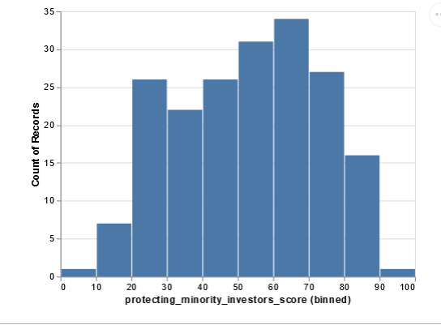
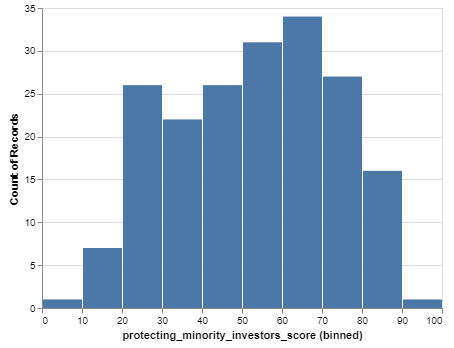
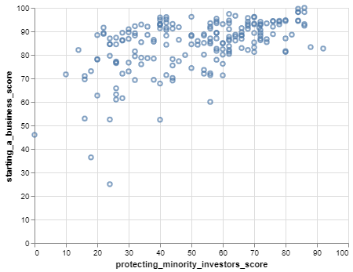
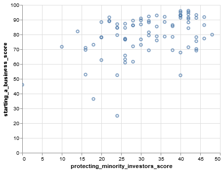
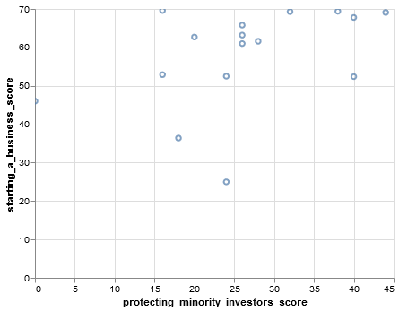
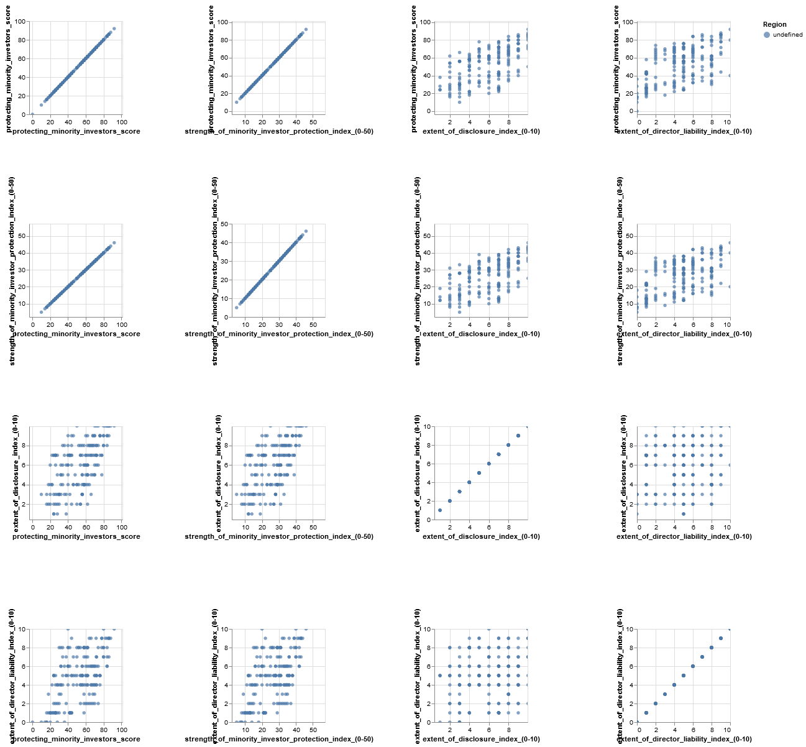

.. Copyright (C)  Google, Runestone Interactive LLC
   This work is licensed under the Creative Commons Attribution-ShareAlike 4.0
   International License. To view a copy of this license, visit
   http://creativecommons.org/licenses/by-sa/4.0/.

Exploratory Data Analysis
=========================

In this section, we will walk you through the process of analyzing and inspecting data. We 
will go over the process of modeling and visualizing a data set with a different set of tools. 
For this exercise, we will use the World Bank Data on Protecting Minority Investors which was 
provided to you in the introduction.

Loading Data into a DataFrame from a CSV File
----------------------------------------------

One of the most common ways you will find data in the contemporary world is in a **CSV file** format. CSV stands for
"comma-separated value," This format allows us to share data files in a simple text format. To get our first glimpse at **Pandas** and its capabilities,
we will be using the data about the countries we used in the spreadsheet module. A CSV file can be opened in any text editor; however, it is sometimes hard to read. Although it is hard to read, the structure makes it easy to parse for analysis, which we will use to our advantage. In the following block of code, you will see the first few lines of the raw CSV file for this project. 
It may look intimidating, but we will unpack it as we go. 

.. code-block:: none
   
   location,protecting_minority_investors_rank,protecting_minority_investors_score,strength_of_minority_investor_protection_index_(0-50),extent_of_disclosure_index_(0-10),extent_of_director_liability_index_(0-10),ease_of_shareholder_suits_index_(0-10),extent_of_shareholder_rights_index_(0-6),extent_of_ownership_and_control_index_(0-7),extent_of_corporate_transparency_index_(0-7),starting_a_business_score
   Afghanistan,140,36.0,18,8.0,1.0,9.0,0.0,0.0,0.0,92
   Albania,111,46.0,23,9.0,7.0,7.0,0.0,0.0,0.0,91.8
   Algeria,179,20.0,10,4.0,1.0,5.0,0.0,0.0,0.0,78
   Angola,147,32.0,16,4.0,6.0,6.0,0.0,0.0,0.0,79.4

You can review the following material to get more familiar with reading and parsing CSV files with Python.
`review this material <https://runestone.academy/runestone/static/fopp/Files/ReadingCSVFiles.html>`_.

.. code:: python3

   %matplotlib inline

   import pandas as pd
   import matplotlib
   import matplotlib.pyplot as plt
   import psycopg2
   import textatistic
   import seaborn as sbn
   from altair import Chart, X, Y, Color, Scale
   import altair as alt
   from vega_datasets import data
   import requests
   from bs4 import BeautifulSoup
   matplotlib.style.use('ggplot')
   # for plotly py.offline.init_notebook_mode()

First, let us start by making use of one of the data reading functions that pandas
provides for us, ``read_csv``.

.. code:: python3

   wd = pd.read_csv('protecting_minority_investors.csv')

.. code:: python3

   wd.head()
   

.. raw:: html

    

    
    <table class="table table-bordered table-hover table-condensed">
    <thead><tr><th title="Field #1"></th>
    <th title="Field #2">location</th>
    <th title="Field #3">protecting_minority_investors_rank</th>
    <th title="Field #4">protecting_minority_investors_score</th>
    <th title="Field #5">strength_of_minority_investor_protection_index_(0-50)</th>
    <th title="Field #6">extent_of_disclosure_index_(0-10)</th>
    <th title="Field #7">extent_of_director_liability_index_(0-10)</th>
    <th title="Field #8">ease_of_shareholder_suits_index_(0-10)</th>
    <th title="Field #9">extent_of_shareholder_rights_index_(0-6)</th>
    <th title="Field #10">extent_of_ownership_and_control_index_(0-7)</th>
    <th title="Field #11">extent_of_corporate_transparency_index_(0-7)</th>
    <th title="Field #12">starting_a_business_score</th>
    </tr></thead>
    <tbody><tr>
    <td align="right">0 </td>
    <td>Afghanistan </td>
    <td align="right">140.0 </td>
    <td align="right">36.0 </td>
    <td align="right">18 </td>
    <td align="right">8.0 </td>
    <td align="right">1.0 </td>
    <td align="right">9.0 </td>
    <td align="right">0.0 </td>
    <td align="right">0.0 </td>
    <td align="right">0.0 </td>
    <td align="right">92.0</td>
    </tr>
    <tr>
    <td align="right">1 </td>
    <td>Albania </td>
    <td align="right">111.0 </td>
    <td align="right">46.0 </td>
    <td align="right">23 </td>
    <td align="right">9.0 </td>
    <td align="right">7.0 </td>
    <td align="right">7.0 </td>
    <td align="right">0.0 </td>
    <td align="right">0.0 </td>
    <td align="right">0.0 </td>
    <td align="right">91.8</td>
    </tr>
    <tr>
    <td align="right">2 </td>
    <td>Algeria </td>
    <td align="right">179.0 </td>
    <td align="right">20.0 </td>
    <td align="right">10 </td>
    <td align="right">4.0 </td>
    <td align="right">1.0 </td>
    <td align="right">5.0 </td>
    <td align="right">0.0 </td>
    <td align="right">0.0 </td>
    <td align="right">0.0 </td>
    <td align="right">78.0</td>
    </tr>
    <tr>
    <td align="right">3 </td>
    <td>Angola </td>
    <td align="right">147.0 </td>
    <td align="right">32.0 </td>
    <td align="right">16 </td>
    <td align="right">4.0 </td>
    <td align="right">6.0 </td>
    <td align="right">6.0 </td>
    <td align="right">0.0 </td>
    <td align="right">0.0 </td>
    <td align="right">0.0 </td>
    <td align="right">79.4</td>
    </tr>
    <tr>
    <td align="right">4 </td>
    <td>Antigua and Barbuda </td>
    <td align="right">79.0 </td>
    <td align="right">58.0 </td>
    <td align="right">29 </td>
    <td align="right"></td>
    <td align="right"> </td>
    <td align="right"> </td>
    <td align="right"> </td>
    <td align="right"> </td>
    <td align="right"> </td>
    <td align="right"> </td>
    </tr>
    </tbody></table>

Describing the Data
-------------------

- Location
- Protecting Minority Investors rank
- Protecting Minority Investors score
- Strength of minority investor protection index (0-50)
- Extent of director liability index (0-10)
- Ease of shareholder suits index (0-10)
- Extent of shareholder rights index (0-6)
- Extent of ownership and control index (0-7)
- Extent of corporate transparency index (0-7)

A handy method that pandas provide us with is ``describe``.
`` describe`` is a method that is used to analyze and calculate statistical data. 
Below is an example of what this method is capable of. 
.. code:: python3

   wd.describe()

.. raw:: html

    

    
        <table class="table table-bordered table-hover table-condensed">
        <table class="table table-bordered table-hover table-condensed">
        <thead><tr><th title="Field #1"></th>
        <th title="Field #2">protecting_minority_investors_rank</th>
        <th title="Field #3">protecting_minority_investors_score</th>
        <th title="Field #4">strength_of_minority_investor_protection_index_(0-50)</th>
        <th title="Field #5">extent_of_disclosure_index_(0-10)</th>
        <th title="Field #6">extent_of_director_liability_index_(0-10)</th>
        <th title="Field #7">ease_of_shareholder_suits_index_(0-10)</th>
        <th title="Field #8">extent_of_shareholder_rights_index_(0-6)</th>
        <th title="Field #9">extent_of_ownership_and_control_index_(0-7)</th>
        <th title="Field #10">extent_of_corporate_transparency_index_(0-7)</th>
        <th title="Field #11">starting_a_business_score</th>
        </tr></thead>
        <tbody><tr>
        <td><b>count</b></td>
        <td align="right">190.000000</td>
        <td align="right">191.000000</td>
        <td align="right">191.000000</td>
        <td align="right">191.000000</td>
        <td align="right">191.000000</td>
        <td align="right">191.000000</td>
        <td align="right">191.000000</td>
        <td align="right">191.000000</td>
        <td align="right">191.000000</td>
        <td align="right">191.000000</td>
        </tr>
        <tr>
        <td><b>mean</b></td>
        <td align="right">92.973684</td>
        <td align="right">51.568586</td>
        <td align="right">25.785340</td>
        <td align="right">5.827225</td>
        <td align="right">4.732984</td>
        <td align="right">6.345550</td>
        <td align="right">2.947644</td>
        <td align="right">2.821990</td>
        <td align="right">3.104712</td>
        <td align="right">84.366492</td>
        </tr>
        <tr>
        <td><b>std</b></td>
        <td align="right">55.125968</td>
        <td align="right">20.099831</td>
        <td align="right">10.050975</td>
        <td align="right">2.562173</td>
        <td align="right">2.664960</td>
        <td align="right">1.907318</td>
        <td align="right">2.233096</td>
        <td align="right">2.406075</td>
        <td align="right">2.593419</td>
        <td align="right">11.250751</td>
        </tr>
        <tr>
        <td><b>min</b></td>
        <td align="right">1.000000</td>
        <td align="right">0.000000</td>
        <td align="right">0.000000</td>
        <td align="right">0.000000</td>
        <td align="right">0.000000</td>
        <td align="right">0.000000</td>
        <td align="right">0.000000</td>
        <td align="right">0.000000</td>
        <td align="right">0.000000</td>
        <td align="right">25.000000</td>
        </tr>
        <tr>
        <td><b>25%</b></td>
        <td align="right">45.000000</td>
        <td align="right">34.000000</td>
        <td align="right">17.000000</td>
        <td align="right">4.000000</td>
        <td align="right">2.000000</td>
        <td align="right">5.000000</td>
        <td align="right">0.000000</td>
        <td align="right">0.000000</td>
        <td align="right">0.000000</td>
        <td align="right">80.000000</td>
        </tr>
        <tr>
        <td><b>50%</b></td>
        <td align="right">88.000000</td>
        <td align="right">56.000000</td>
        <td align="right">28.000000</td>
        <td align="right">6.000000</td>
        <td align="right">5.000000</td>
        <td align="right">6.000000</td>
        <td align="right">4.000000</td>
        <td align="right">3.000000</td>
        <td align="right">3.000000</td>
        <td align="right">87.000000</td>
        </tr>
        <tr>
        <td><b>75%</b></td>
        <td align="right">142.250000</td>
        <td align="right">68.000000</td>
        <td align="right">34.000000</td>
        <td align="right">8.000000</td>
        <td align="right">7.000000</td>
        <td align="right">8.000000</td>
        <td align="right">5.000000</td>
        <td align="right">5.000000</td>
        <td align="right">6.000000</td>
        <td align="right">92.250000</td>
        </tr>
        <tr>
        <td><b>max</b></td>
        <td align="right">190.000000</td>
        <td align="right">92.000000</td>
        <td align="right">46.000000</td>
        <td align="right">10.000000</td>
        <td align="right">10.000000</td>
        <td align="right">10.000000</td>
        <td align="right">6.000000</td>
        <td align="right">7.000000</td>
        <td align="right">7.000000</td>
        <td align="right">100.000000</td>
        </tr>
        </tbody></table>

Visualizing Data with Histogram
--------------------------------

.. code:: python3

   c = Chart(wd) # make a chart
   m = c.mark_bar() # set the mark -- returns a new Chart
   e = m.encode(X('protecting_minority_investors_score',bin=True),y='count()') # set the encoding
   e.display()

The code above explains every step in detail on how to make a **histogram** chart, creating a mark that returns
the new chart to adding encoding. However, there is also a shortcut to what we did above. We can write that code into a single line because once we create a mark, we can start to add the encoding right away.
The other methods are designed to return the proper object. Therefore, we can write all of the
calls above into a single line. We also do not need to explicitly call "display" because Altair returns an object that the Jupyter environment knows how to display automatically.
 

.. code:: python3

   Chart(wd).mark_bar().encode(x=X('protecting_minority_investors_score', bin=True), y='count()')

Practice
--------

.. fillintheblank:: fact_disclosure_index
   :casei:
   
   What is the range of values for the tallest bar when creating a histogram of the extent of disclosure index (0-10)? Lower: |blank| Upper: |blank|

   - :7: Is the correct answer
     :6: Just a little too low
     :x: Try again, look closer at the histogram

   - :8: Is correct
     :x: Try again, look closer at the histogram

.. fillintheblank:: fact_direct_liability_index
   :casei:

   What is the range of values for the tallest bar when creating a histogram of
   the extent of director liability index? Lower: |blank| Upper: |blank|

   - :(5): Is the correct answer
     :.4: Just a little too low
     :x: Try again, look closer at the histogram

   - :(6): Is correct
     :x: Try again, look closer at the histogram

.. fillintheblank:: fact_liability_index2
   :casei:

   Approximately how many countries have a score between 8.0 and 9.0 in the extent of the director liability index? |blank|

   - :(23|24): Is the correct answer
     :x: Try again, the number is less than 25

Scatter Plots for Discovering Relationships
--------------------------------------------

We can visualize and show the relationship between data using **scatter plots**.
Let's make a simple scatter plot of protecting_minority_investors_score versus starting_a_business_score of the
locations. For this exercise, we will use `Protecting Minority Investors CSV file <../_static/protecting_minority_investors.csv>`_.

.. code:: python3

   Chart(wd).mark_point().encode(x='protecting_minority_investors_score', y='starting_a_business_score', tooltip='location')

As we can see, that is a very scattered graph that does not focus on one area. Let’s redo the graph so we can focus on one area.
Let us focus on the locations where protecting_minority_investors_score is less than 50, and the starting_a_business_score is less than 70. Let’s start with the first part.

To do this, we will create a new **DataFrame** where we focus on the locations where the protecting_minority_investors_score is less than 50, and the locations starting_a_business_score is less than 70. Pandas make this easy with its querying power. 

The statement below produces a series of **boolean values**. These boolean values are used to index the data frame and only the rows 
corresponding to True values are returned in the result.

.. code:: python3

   (wd.protecting_minority_investors_score < 50).head(20) 
   

.. parsed-literal::

   0     True
   1     True
   2     True
   3     True
   4     True
   5     True
   6     True
   7     True
   8     True
   9     True
   10    True
   11    True
   12    True
   13    True
   14    True
   15    True
   16    True
   17    True
   18    True
   19    True
   Name: Population, dtype: bool

Let's look at the locations of less than 20.

.. code:: python3

   wd[wd.protecting_minority_investors_score < 20]

.. raw:: html

    

    
    <table class="table table-bordered table-hover table-condensed">
    <thead><tr><th title="Field #1"></th>
    <th title="Field #2">location</th>
    <th title="Field #3">protecting_minority_investors_rank</th>
    <th title="Field #4">protecting_minority_investors_score</th>
    <th title="Field #5">strength_of_minority_investor_protection_index_(0-50)</th>
    <th title="Field #6">extent_of_disclosure_index_(0-10)</th>
    <th title="Field #7">extent_of_director_liability_index_(0-10)</th>
    <th title="Field #8">ease_of_shareholder_suits_index_(0-10)</th>
    <th title="Field #9">extent_of_shareholder_rights_index_(0-6)</th>
    <th title="Field #10">extent_of_ownership_and_control_index_(0-7)</th>
    <th title="Field #11">extent_of_corporate_transparency_index_(0-7)</th>
    <th title="Field #12">starting_a_business_score</th>
    </tr></thead>
    <tbody><tr>
    <td><b>52</b></td>
    <td>Eritrea</td>
    <td align="right">185.0</td>
    <td align="right">16.0</td>
    <td align="right">8</td>
    <td align="right">3</td>
    <td align="right">0</td>
    <td align="right">5</td>
    <td>0</td>
    <td>0</td>
    <td>0</td>
    <td align="right">52.9</td>
    </tr>
    <tr>
    <td><b>55</b></td>
    <td>Ethiopia</td>
    <td align="right">189.0</td>
    <td align="right">10.0</td>
    <td align="right">5</td>
    <td align="right">3</td>
    <td align="right">0</td>
    <td align="right">2</td>
    <td>0</td>
    <td>0</td>
    <td>0</td>
    <td align="right">71.7</td>
    </tr>
    <tr>
    <td><b>70</b></td>
    <td>Haiti</td>
    <td align="right">183.0</td>
    <td align="right">18.0</td>
    <td align="right">9</td>
    <td align="right">2</td>
    <td align="right">3</td>
    <td align="right">4</td>
    <td>0</td>
    <td>0</td>
    <td>0</td>
    <td align="right">36.4</td>
    </tr>
    <tr>
    <td><b>97</b></td>
    <td>Libya</td>
    <td align="right">183.0</td>
    <td align="right">18.0</td>
    <td align="right">9</td>
    <td align="right">4</td>
    <td align="right">1</td>
    <td align="right">4</td>
    <td>0</td>
    <td>0</td>
    <td>0</td>
    <td align="right">73.1</td>
    </tr>
    <tr>
    <td><b>111</b></td>
    <td>Micronesia, Fed. Sts.</td>
    <td align="right">185.0</td>
    <td align="right">16.0</td>
    <td align="right">8</td>
    <td align="right">0</td>
    <td align="right">0</td>
    <td align="right">8</td>
    <td>0</td>
    <td>0</td>
    <td>0</td>
    <td align="right">69.6</td>
    </tr>
    <tr>
    <td><b>129</b></td>
    <td>Palau</td>
    <td align="right">188.0</td>
    <td align="right">14.0</td>
    <td align="right">7</td>
    <td align="right">0</td>
    <td align="right">0</td>
    <td align="right">7</td>
    <td>0</td>
    <td>0</td>
    <td>0</td>
    <td align="right">82.1</td>
    </tr>
    <tr>
    <td><b>154</b></td>
    <td>Somalia</td>
    <td align="right">190.0</td>
    <td align="right">0.0</td>
    <td align="right">0</td>
    <td align="right">0</td>
    <td align="right">0</td>
    <td align="right">0</td>
    <td>0</td>
    <td>0</td>
    <td>0</td>
    <td align="right">46.0</td>
    </tr>
    <tr>
    <td><b>156</b></td>
    <td>South Sudan</td>
    <td align="right">185.0</td>
    <td align="right">16.0</td>
    <td align="right">8</td>
    <td align="right">2</td>
    <td align="right">1</td>
    <td align="right">5</td>
    <td>0</td>
    <td>0</td>
    <td>0</td>
    <td align="right">71.0</td>
    </tr>
    </tbody></table>
    

Next, we can use this information and graph these locations to get a visual representation of the data.
You can do this two ways; you can assign your query to a variable and putting the variable in the call to create a chart.
Or, you can put the query right into the call to create a chart.  

.. code:: python3

    Chart(wd[wd.protecting_minority_investors_score < 50]).mark_point().encode(
        x='protecting_minority_investors_score', y='starting_a_business_score', tooltip='location').interactive()

Pretty neat! As we can see, one location has a minimal value while others are farther to the right. This graph encapsulates all the protecting_minority_investors_score
that is less than 20; we also added a tooltip parameter so that if you hover over that point, you will see it is Somalia. Let's improve our query to focus on the locations where starting_a_business_score is less than 70.

We can create a more complicated boolean expression by using "| "(logical *or*)
and ``&`` (logical *and*) operators. In Python, these two operators are
used for bitwise *or* and bitwise *and*.

.. code:: python3

   wd[(wd.protecting_minority_investors_score < 50) & (wd.starting_a_business_score < 70)]

.. raw:: html

    

    
    <table class="table table-bordered table-hover table-condensed">
    <thead><tr><th title="Field #1"></th>
    <th title="Field #2">location</th>
    <th title="Field #3">protecting_minority_investors_rank</th>
    <th title="Field #4">protecting_minority_investors_score</th>
    <th title="Field #5">strength_of_minority_investor_protection_index_(0-50)</th>
    <th title="Field #6">extent_of_disclosure_index_(0-10)</th>
    <th title="Field #7">extent_of_director_liability_index_(0-10)</th>
    <th title="Field #8">ease_of_shareholder_suits_index_(0-10)</th>
    <th title="Field #9">extent_of_shareholder_rights_index_(0-6)</th>
    <th title="Field #10">extent_of_ownership_and_control_index_(0-7)</th>
    <th title="Field #11">extent_of_corporate_transparency_index_(0-7)</th>
    <th title="Field #12">starting_a_business_score</th>
    </tr></thead>
    <tbody><tr>
    <td align="right">19 </td>
    <td>Bolivia </td>
    <td align="right">136.0 </td>
    <td align="right">38.0 </td>
    <td align="right">19 </td>
    <td align="right">1.0 </td>
    <td align="right">5.0 </td>
    <td align="right">6.0 </td>
    <td align="right">4.0 </td>
    <td align="right">1.0 </td>
    <td align="right">2.0 </td>
    <td align="right">69.4</td>
    </tr>
    <tr>
    <td align="right">28 </td>
    <td>Cambodia </td>
    <td align="right">128.0 </td>
    <td align="right">40.0 </td>
    <td align="right">20 </td>
    <td align="right">6.0 </td>
    <td align="right">10.0 </td>
    <td align="right">4.0 </td>
    <td align="right">0.0 </td>
    <td align="right">0.0 </td>
    <td align="right">0.0 </td>
    <td align="right">52.4</td>
    </tr>
    <tr>
    <td align="right">31 </td>
    <td>Central African Republic </td>
    <td align="right">162.0 </td>
    <td align="right">26.0 </td>
    <td align="right">13 </td>
    <td align="right">7.0 </td>
    <td align="right">1.0 </td>
    <td align="right">5.0 </td>
    <td align="right">0.0 </td>
    <td align="right">0.0 </td>
    <td align="right">0.0 </td>
    <td align="right">63.2</td>
    </tr>
    <tr>
    <td align="right">32 </td>
    <td>Chad </td>
    <td align="right">170.0 </td>
    <td align="right">24.0 </td>
    <td align="right">12 </td>
    <td align="right">7.0 </td>
    <td align="right">1.0 </td>
    <td align="right">4.0 </td>
    <td align="right">0.0 </td>
    <td align="right">0.0 </td>
    <td align="right">0.0 </td>
    <td align="right">52.5</td>
    </tr>
    <tr>
    <td align="right">38 </td>
    <td>Congo, Rep. </td>
    <td align="right">162.0 </td>
    <td align="right">26.0 </td>
    <td align="right">13 </td>
    <td align="right">7.0 </td>
    <td align="right">1.0 </td>
    <td align="right">5.0 </td>
    <td align="right">0.0 </td>
    <td align="right">0.0 </td>
    <td align="right">0.0 </td>
    <td align="right">65.8</td>
    </tr>
    <tr>
    <td align="right">48 </td>
    <td>Ecuador </td>
    <td align="right">114.0 </td>
    <td align="right">44.0 </td>
    <td align="right">22 </td>
    <td align="right">2.0 </td>
    <td align="right">5.0 </td>
    <td align="right">6.0 </td>
    <td align="right">5.0 </td>
    <td align="right">3.0 </td>
    <td align="right">1.0 </td>
    <td align="right">69.1</td>
    </tr>
    <tr>
    <td align="right">51 </td>
    <td>Equatorial Guinea </td>
    <td align="right">162.0 </td>
    <td align="right">26.0 </td>
    <td align="right">13 </td>
    <td align="right">7.0 </td>
    <td align="right">1.0 </td>
    <td align="right">5.0 </td>
    <td align="right">0.0 </td>
    <td align="right">0.0 </td>
    <td align="right">0.0 </td>
    <td align="right">61.0</td>
    </tr>
    <tr>
    <td align="right">52 </td>
    <td>Eritrea </td>
    <td align="right">185.0 </td>
    <td align="right">16.0 </td>
    <td align="right">8 </td>
    <td align="right">3.0 </td>
    <td align="right">0.0 </td>
    <td align="right">5.0 </td>
    <td align="right">0.0 </td>
    <td align="right">0.0 </td>
    <td align="right">0.0 </td>
    <td align="right">52.9</td>
    </tr>
    <tr>
    <td align="right">70 </td>
    <td>Haiti </td>
    <td align="right">183.0 </td>
    <td align="right">18.0 </td>
    <td align="right">9 </td>
    <td align="right">2.0 </td>
    <td align="right">3.0 </td>
    <td align="right">4.0 </td>
    <td align="right">0.0 </td>
    <td align="right">0.0 </td>
    <td align="right">0.0 </td>
    <td align="right">36.4</td>
    </tr>
    <tr>
    <td align="right">77 </td>
    <td>Iran, Islamic Rep. </td>
    <td align="right">128.0 </td>
    <td align="right">40.0 </td>
    <td align="right">20 </td>
    <td align="right">7.0 </td>
    <td align="right">4.0 </td>
    <td align="right">1.0 </td>
    <td align="right">3.0 </td>
    <td align="right">3.0 </td>
    <td align="right">2.0 </td>
    <td align="right">67.8</td>
    </tr>
    <tr>
    <td align="right">92 </td>
    <td>Lao PDR </td>
    <td align="right">179.0 </td>
    <td align="right">20.0 </td>
    <td align="right">10 </td>
    <td align="right">6.0 </td>
    <td align="right">1.0 </td>
    <td align="right">3.0 </td>
    <td align="right">0.0 </td>
    <td align="right">0.0 </td>
    <td align="right">0.0 </td>
    <td align="right">62.7</td>
    </tr>
    <tr>
    <td align="right">111 </td>
    <td>Micronesia, Fed. Sts. </td>
    <td align="right">185.0 </td>
    <td align="right">16.0 </td>
    <td align="right">8 </td>
    <td align="right">0.0 </td>
    <td align="right">0.0 </td>
    <td align="right">8.0 </td>
    <td align="right">0.0 </td>
    <td align="right">0.0 </td>
    <td align="right">0.0 </td>
    <td align="right">69.6</td>
    </tr>
    <tr>
    <td align="right">116 </td>
    <td>Mozambique </td>
    <td align="right">147.0 </td>
    <td align="right">32.0 </td>
    <td align="right">16 </td>
    <td align="right">5.0 </td>
    <td align="right">4.0 </td>
    <td align="right">7.0 </td>
    <td align="right">0.0 </td>
    <td align="right">0.0 </td>
    <td align="right">0.0 </td>
    <td align="right">69.3</td>
    </tr>
    <tr>
    <td align="right">154 </td>
    <td>Somalia </td>
    <td align="right">190.0 </td>
    <td align="right">0.0 </td>
    <td align="right">0 </td>
    <td align="right">0.0 </td>
    <td align="right">0.0 </td>
    <td align="right">0.0 </td>
    <td align="right">0.0 </td>
    <td align="right">0.0 </td>
    <td align="right">0.0 </td>
    <td align="right">46.0</td>
    </tr>
    <tr>
    <td align="right">163 </td>
    <td>Suriname </td>
    <td align="right">157.0 </td>
    <td align="right">28.0 </td>
    <td align="right">14 </td>
    <td align="right">1.0 </td>
    <td align="right">0.0 </td>
    <td align="right">6.0 </td>
    <td align="right">4.0 </td>
    <td align="right">2.0 </td>
    <td align="right">1.0 </td>
    <td align="right">61.6</td>
    </tr>
    <tr>
    <td align="right">185 </td>
    <td>Venezuela, RB </td>
    <td align="right">170.0 </td>
    <td align="right">24.0 </td>
    <td align="right">12 </td>
    <td align="right">3.0 </td>
    <td align="right">2.0 </td>
    <td align="right">3.0 </td>
    <td align="right">1.0 </td>
    <td align="right">2.0 </td>
    <td align="right">1.0 </td>
    <td align="right">25.0</td>
    </tr>
    </tbody></table>
    

.. code:: python3
      
   Chart(wd[(wd.protecting_minority_investors_score < 50) & (wd.starting_a_business_score < 70)]).mark_point().encode(
       x='protecting_minority_investors_score', y='starting_a_business_score', tooltip='location').interactive()

Now, let’s suppose you want to travel and start your dream business in one of your favorite locations. For example, 
let’s say you have always wanted to go to Malta and start your business; you might be curious about Malta. Let’s see what data we have in the data frame for Malta using equality. 

.. code:: python3
   
   wd[wd.location == 'Malta']

.. raw:: html

    

    
    <table class="table table-bordered table-hover table-condensed">
    <thead><tr><th title="Field #1"></th>
    <th title="Field #2">location</th>
    <th title="Field #3">protecting_minority_investors_rank</th>
    <th title="Field #4">protecting_minority_investors_score</th>
    <th title="Field #5">strength_of_minority_investor_protection_index_(0-50)</th>
    <th title="Field #6">extent_of_disclosure_index_(0-10)</th>
    <th title="Field #7">extent_of_director_liability_index_(0-10)</th>
    <th title="Field #8">ease_of_shareholder_suits_index_(0-10)</th>
    <th title="Field #9">extent_of_shareholder_rights_index_(0-6)</th>
    <th title="Field #10">extent_of_ownership_and_control_index_(0-7)</th>
    <th title="Field #11">extent_of_corporate_transparency_index_(0-7)</th>
    <th title="Field #12">starting_a_business_score</th>
    </tr></thead>
    <tbody><tr>
    <td align="right">106</td>
    <td>Malta</td>
    <td align="right">51</td>
    <td align="right">66</td>
    <td align="right">33</td>
    <td align="right">3</td>
    <td align="right">6</td>
    <td align="right">8</td>
    <td align="right">6</td>
    <td align="right">4</td>
    <td align="right">6</td>
    <td align="right">88.2</td>
    </tr>
    </tbody></table>
    

As you can see, we found very interesting information about Malta. You can try some other countries on your own but
keep in mind that sometimes names and other string can end up with spaces at the beginning or the end of the word or phrase. 
For instance, Malta could have ended up with space at the end of the data set. We might not have been able to get the information using 'Malta' and might have
had to type 'Malta '. This would have been very inconvenient, and we don't want to have to remember to put spaces at the beginning or end of every string. 
Therefore, we always need to do a bit of cleanup to strip those spaces.

Python has a method called ``strip`` which does what we want, it removes characters
from left and right based on the argument passed. You may be wondering, how can we apply this to all of the strings
in the series. Well, Pandas allows us to do this using the ``str`` attribute of the series in combination with most of the standard string methods you know about.

.. code:: python3
   
   wd.location.str.strip()

.. parsed-literal::

   0              Afghanistan
   1                  Albania
   2                  Algeria
   3                   Angola
   4      Antigua and Barbuda
               ...         
   186                Vietnam
   187     West Bank and Gaza
   188            Yemen, Rep.
   189                 Zambia
   190               Zimbabwe
   Name: location, Length: 191, dtype: object

If Malta had space after it, the strip method would get rid of it, and we could just use 'Malta' to get the 
necessary information from our data set.

.. code:: python3

   wd[wd.location == 'Malta']

.. raw:: html

    

    
    <table class="table table-bordered table-hover table-condensed">
    <thead><tr><th title="Field #1"></th>
    <th title="Field #2">location</th>
    <th title="Field #3">protecting_minority_investors_rank</th>
    <th title="Field #4">protecting_minority_investors_score</th>
    <th title="Field #5">strength_of_minority_investor_protection_index_(0-50)</th>
    <th title="Field #6">extent_of_disclosure_index_(0-10)</th>
    <th title="Field #7">extent_of_director_liability_index_(0-10)</th>
    <th title="Field #8">ease_of_shareholder_suits_index_(0-10)</th>
    <th title="Field #9">extent_of_shareholder_rights_index_(0-6)</th>
    <th title="Field #10">extent_of_ownership_and_control_index_(0-7)</th>
    <th title="Field #11">extent_of_corporate_transparency_index_(0-7)</th>
    <th title="Field #12">starting_a_business_score</th>
    </tr></thead>
    <tbody><tr>
    <td align="right">106</td>
    <td>Malta</td>
    <td align="right">51</td>
    <td align="right">66</td>
    <td align="right">33</td>
    <td align="right">3</td>
    <td align="right">6</td>
    <td align="right">8</td>
    <td align="right">6</td>
    <td align="right">4</td>
    <td align="right">6</td>
    <td align="right">88.2</td>
    </tr>
    </tbody></table>
    

Power Tools: Scatter Matrix
---------------------------

There might be endless pairs of things we might want to see if there is any correlation. 
However, this would take a long time and can be very tedious. This is where Scatter Matrix 
comes into the rescue. Scatter Matrix allows you to see multiple pairs of things at once, as shown below. 

.. code:: python3

    alt.Chart(wd).mark_circle().encode(
        alt.X(alt.repeat("column"), type='quantitative'),
        alt.Y(alt.repeat("row"), type='quantitative'),
        color='Region:N'
    ).properties(
        width=150,
        height=150
    ).repeat(
        row=['protecting_minority_investors_score', 'strength_of_minority_investor_protection_index_(0-50)', 'extent_of_disclosure_index_(0-10)', 'extent_of_director_liability_index_(0-10)'],
        column=['protecting_minority_investors_score', 'strength_of_minority_investor_protection_index_(0-50)', 'extent_of_disclosure_index_(0-10)', 'extent_of_director_liability_index_(0-10)']
    ).interactive()

.. code:: python3

   list(reversed(['a','b']))

.. parsed-literal::

   ['b', 'a']

Developing Fluency
------------------

As we saw, Pandas can be very useful and powerful. It was probably a lot to take in, 
but if you develop fluency in the basics, it can be part of your daily workflow. Queries are a big part of Pandas; therefore, you should strive to make simple queries without thinking about the syntax. Lots of practice and repetition can achieve this. 

That doesn't mean you can't go on and do lots of much harder things, it just
means that it will take longer at first, as you have to go back and review
documentation to become efficient.

Practice Questions
------------------

1. What are the top 10 countries by starting a business score?
2. What are the top 20 countries by protecting minority investors' scores?
3. What are the 10 countries with the highest score in the extent of ownership and control index (0-7)?
4. What are the names, protecting minority investors rank, and starting a business score of the 5 largest countries?
5. What are the names and their starting a business score of the five ranked countries?

    